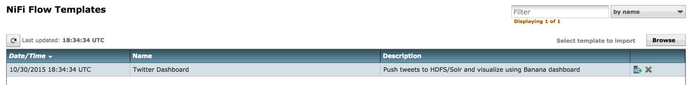
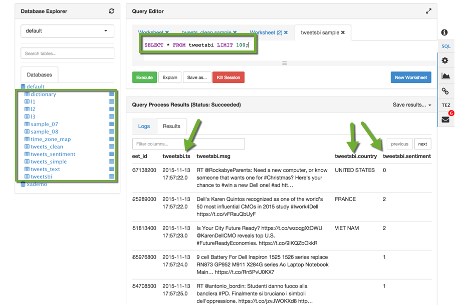

# Analyzing Twitter Data With Apache NiFi and HDP Search

## Introduction

I this tutorial we will learn how to install Apache NiFi on your Hortonworks Sandbox if you do not have it pre-installed already. Using NiFi we will create a data flow that can pull tweets directly from the [Twitter API](https://dev.twitter.com/overview/documentation).

We will then use [Solr](http://hortonworks.com/hadoop/solr/) and the [LucidWorks HDP Search](http://hortonworks.com/press-releases/hortonworks-partners-lucidworks-bring-search-big-data/) to view our streamed data in realtime to gather insights as the data arrives in our Hadoop cluster.

Next, we will be using Hive to analyze the social sentiment after we have finished collecting our data from NiFi.

Finally, we will use [Apache Zeppelin](http://hortonworks.com/hadoop/zeppelin/) to create charts so that we can visualize our data directly inside of our Hadoop cluster.

### List of technologies in this tutorial:

- [Hortonworks Sandbox](http://hortonworks.com/products/hortonworks-sandbox/)
- [Apache NiFi](http://hortonworks.com/products/dataflow/)
- [Solr + LucidWorks HDP Search](http://hortonworks.com/press-releases/hortonworks-partners-lucidworks-bring-search-big-data/)
- [Hive and Ambari Views](http://hortonworks.com/hadoop/hive/)
- [Apache Zeppelin](http://hortonworks.com/hadoop/zeppelin/)
- [Twitter API](https://dev.twitter.com/)

## Pre-Requisites

- Downloaded and Installed the [Hortonworks Sandbox with HDP 2.3](http://hortonworks.com/hdp/downloads/)
- Added `sandbox.hortonworks.com` to your `/etc/hosts` file.

If you haven't added `sandbox.hortonworks.com` to your lists of hosts you can do so with the following command on a unix system:

~~~
cat /etc/hosts > "127.0.0.1     sandbox.hortonworks.com"
~~~

## Outline

1. [Install Apache Nifi](#install-apache-nifi)
2. [Configure and Start Solr](#configure-and-start-solr)
3. [Creating a Twitter Application](#creating-a-twitter-application)
4. [Create a Data Flow with Nifi](#creating-a-data-flow-with-nifi)
5. [(Optional) Generating Random Twitter Data](#generating-random-tweet-data-for-hive-and-solr)
6. [Analyze and Search Data with Solr](#analyze-and-search-data-with-solr)
7. [Analyzing Tweet Data in Hive](#analyzing-tweet-data-in-hive)
8. [Visualizing Sentiment with Zeppelin](#visualizing-sentiment-with-zeppelin)

-----------------

## Install Apache Nifi

The first thing you're going to need if you haven't done it already is install the Apache Nifi service on your Sandbox.

#### SSH into your Sandbox

If you've already logged into your sandbox through SSH your password will be different than below.

| username | password |
|:--------:|:--------:|
|  _root_  | _hadoop_ |

> **Note** that you will be prompted to change the `root` user's password once you login to the sandbox. **Do NOT forget this!**

There are two options to connecting to your sandbox to execute terminal commands. The first is by using the terminal emulator at [http://sandbox.hortonworks.com:4200](http://sandbox.hortonworks.com:4200). Or you can open a terminal on your computer and use the following command

~~~
ssh root@127.0.0.1 -p 2222
~~~

Once you've successfully connected to the sandbox you'll need to execute the following command to install the Ambari Nifi service

~~~
VERSION=`hdp-select status hadoop-client | sed 's/hadoop-client - \([0-9]\.[0-9]\).*/\1/'`
sudo git clone https://github.com/abajwa-hw/ambari-nifi-service.git   /var/lib/ambari-server/resources/stacks/HDP/$VERSION/services/NIFI
~~~

Then you'll need to restart Ambari Server. Use the following command:

~~~
sudo service ambari restart
~~~

Once Ambari restarts navigate back over to the Ambari Dashboard at  [http://sandbox.hortonworks.com:8080](http://sandbox.hortonworks.com:8080) and click **Add Service** on the bottom of left sidebar.

After you've clicked **Add Service** you will be greeted with the Add Service Wizard. Scroll down and look for the **NiFi** service. **Check the box** next to NiFi and click **Next**.

Continue through the add Service Wizard until you reach the screen below. Click **Deploy**. Then Ambari will install, start, and test NiFi on the sandbox.

After clicking **Deploy** wait until Ambari completely installs Nifi and click **Next**.

NiFi should now appear as a service on the left hand side of the ambari dashboard.

Great! NiFi is now installed on your Sandbox! 

Make sure you can reach the NiFi user interface at [http://sandbox.hortonworks.com:9090/nifi](http://sandbox.hortonworks.com:9090/nifi).

If you can't access it, then you might need to forward port `9090` on your virtual machine.

For VirtualBox you can forward the port by

1. Opening VirtualBox Manager
2. Right click your running Hortonworks Sandbox, click **Settings**
3. Go to the **Network** Tab
4. Click the button that says **Port Forwarding**. Add an entry with the following values

| Name | Protocol| Host IP | Host Port | Guest IP | Guest Port |
|------|---------|---------|-----------|----------|------------|
| NiFi |   TCP   |127.0.0.1|    9090   |          |    9090    |

You should now be able to access the NiFi user interface at [http://sandbox.hortonworks.com:9090/nifi](http://sandbox.hortonworks.com:9090/nifi).

## Configure and Start Solr

Hortonworks Sandbox with HDP 2.3.2 has the **Lucidworks HDP Search** Pre-installed.

We just need to make a few quick changes.

First, we need to modify some file permissions. Open your terminal shell and SSH back into the sandbox. Execute the following

~~~
chown -R solr:solr /opt/lucidworks-hdpsearch/solr
~~~

We're going to need to run the following commands as the Solr user. run

~~~
su solr
~~~

Then we need to edit the following file to make sure that Solr can recognize a tweet's timestamp format.

~~~
vi /opt/lucidworks-hdpsearch/solr/server/solr/configsets/data_driven_schema_configs/conf/solrconfig.xml
~~~

Once the file is opened in `vi` type 

**Note**: In **vi** the command below should not be run in **INSERT** mode.  `/` will do a find for the text that you type after it.

~~~
/class="solr.ParseDateFieldUpdateProcessorFactory"
~~~

This will bring you to the part of the config where we need to add the following:

~~~
<str>EEE MMM d HH:mm:ss Z yyyy</str>
~~~

Make sure this is inserted just above all of the other `<str>` tags.

**Note**. In `vi`, to type or insert anything you must be in _insert mode_. Press `i` on your keyboard to enter insert mode in `vi`.

After inserting the above, the portion of the file should look something like this:

~~~
<processor class="solr.ParseLongFieldUpdateProcessorFactory"/>
    <processor class="solr.ParseDoubleFieldUpdateProcessorFactory"/>
    <processor class="solr.ParseDateFieldUpdateProcessorFactory">
      <arr name="format">
        <str>EEE MMM d HH:mm:ss Z yyyy</str>
        <str>yyyy-MM-dd'T'HH:mm:ss.SSSZ</str>
        <str>yyyy-MM-dd'T'HH:mm:ss,SSSZ</str>
        <str>yyyy-MM-dd'T'HH:mm:ss.SSS</str>
        <str>yyyy-MM-dd'T'HH:mm:ss,SSS</str>
        <str>yyyy-MM-dd'T'HH:mm:ssZ</str>
		.
		.
		.
~~~

Finally press the **Escape key** on your keyboard and type `:wq` to save and close the `solrconfig.xml` file.

Next we need to replace a JSON file. Use the following commands to move the original and download the replacement file:

~~~
cd /opt/lucidworks-hdpsearch/solr/server/solr-webapp/webapp/banana/app/dashboards/
mv default.json default.json.orig
wget https://raw.githubusercontent.com/ZacBlanco/hdp-tutorials/master/nifi-flow-tutorial/assets/default.json
~~~

Now we're going to start Solr. Execute

~~~
/opt/lucidworks-hdpsearch/solr/bin/solr start -c -z localhost:2181
~~~

Then we are going to add a collection called "tweets"

~~~
/opt/lucidworks-hdpsearch/solr/bin/solr create -c tweets \
   -d data_driven_schema_configs \
   -s 1 \
   -rf 1
~~~

We can now go back to running commands as the root user. Run 

~~~
exit
~~~

This will log you out of the `solr` user

Lastly, we need to update the system time on the sandbox so that we will be able to process the tweets correctly in NiFi

~~~
yum install -y ntp
service ntpd stop
ntpdate pool.ntp.org
service ntpd start
~~~

Great! Now Solr should be installed and running on your sandbox!

Ensure that you can access the Solr UI by navigating to [http://sandbox.hortonworks.com:8983/solr/](http://sandbox.hortonworks.com:8983/solr/)

## Creating a Twitter Application

If you would rather not register your own twitter application and use previous data, please head to the [next section](#analyze-and-search-data-with-solr) where you can download the sample dataset.

If you want to pull live data from Twitter in this tutorial you'll need to register your own twitter application. It's quite simple and only takes a few short steps

First head over to the [Twitter Apps Website](http://apps.twitter.com) and Sign In using your Twitter account (or make one if you don't have one yet!)

Then click **Create a New App**.

After you've clicked that you'll need to fill in some details about your application. Feel free to put whatever you want.

 Then click **Create Your Twitter Application** at the bottom of the screen after reading the developer agreement.

> Note that you might need to add your mobile phone to your Twitter account before creating your application

Once you've done that you should be greeted by a dashboard for your Twitter application. Head over to the permissions tab and select the **Read Only** Option and **Update** your application.

Finally you need to generate your OAuth key. You can do this by clicking **Test OAuth** on the top of the permissions page, or by heading to **Keys and Access Tokens** and then finding the option that allows you to generate your OAuth tokens.

Finally, your keys and access tokens should look similar to the following:

Please make note of your **Consumer Key**, **Consumer Secret**, **Access Token**, and **Access Token Secret**. You will need these to create the data flow in NiFi.

## Create a Data Flow with NiFi

The first thing you'll need to do here is download the NiFi data flow template for the [Twitter Dashboard here](https://raw.githubusercontent.com/ZacBlanco/hdp-tutorials/master/nifi-flow-tutorial/assets/Twitter_Flow.xml)

[**Download**](https://raw.githubusercontent.com/ZacBlanco/hdp-tutorials/master/nifi-flow-tutorial/assets/Twitter_Flow.xml)

Make note of where you download this file. You'll need it in the next step.

Open up the NiFi user interface found at [http://sandbox.hortonworks.com:9090/nifi](http://sandbox.hortonworks.com:9090/nifi). Then you'll need to import the template you just downloaded into NiFi. 

Import the template by clicking **Templates** icon on the top right corner of the screen (Third from the right).

Then click **Browse** and navigate to the `Twitter_Dashboard.xml` file that you just previously downloaded.

Once you've selected the file you can click **Import**.

You should now see the template appear below.

Now that we've got the template imported into NiFi we can instanstiate it. Drag the template icon (the 7th from the left) onto the workspace.

Then a dialog box should appear. Make sure that **Twitter Dashboard** is selected and click **Add**.

After clicking import you should have a screen similar to the following:

Now we'll need to configure the Twitter Hose with the access tokens that we made earlier for our twitter application.

Right click on the **Grab Garden Hose** element and click **Configure**

Then you're going to need to place all of those twitter API tokens from earlier in their respective places. Then hit **Apply**.

Once you've got all of your peroperties set up you can take a look at the configurations of some of the other processsors in our data.

Once you've done that head to the top of the page and lick the play button to watch the tweets roll in! Note that all of the red squares have now turned to green arrows.

If only one of the boxes changes when you click **Start**, make sure that you don't have any specific processor selected. Deselect things by simply clicking on the blank area of the screen.

## Generating Random Tweet Data for Hive and Solr

This section is for anyone who didn't want to set up a Twitter app so they could stream custom data. We're just going to use a script to generate some data and then put that into Hive and Solr. Skip to the next section if you have already set up NiFi to collect tweets.

First you'll need to SSH into the sandbox execute the following command

~~~
wget https://raw.githubusercontent.com/ZacBlanco/hdp-tutorials/master/nifi-flow-tutorial/assets/twitter-gen.sh
~~~

Then run the command with your specified number of tweets that you would like to generate.

~~~
bash twitter-gen.sh {NUMBER_OF_TWEETS}
~~~

Example:

~~~
bash twitter-gen.sh 2000
~~~

The script will generate the data and put it in the directory `/tmp/data/`

You can now continue on with the rest of the tutorial.

## Analyze and Search Data with Solr
------------------------------------

Now that we have our data in HDP-Search/Solr we can go ahead and start searching through our data.
If you are using NiFi to stream the data you can head over to the Banana Dashboard at [http://sandbox.hortonworks.com:8983/solr/banana/](http://sandbox.hortonworks.com:8983/solr/banana/index.html)

The dashboard was designed by the `default.json` file that we had downloaded previously. You can find more about [Banana here](https://github.com/LucidWorks/banana)

You should be able to see the constant flow of data here and you can analyze some of it as it is dropped into the Solr index from NiFi. Try exploring the charts and see what each one does. It should be important to note that all of the graphs on the page include data that was queried straight from Solr to create those images using [d3.js](http://d3js.org/). You can see the queries for each graph by clicking the small **gear icon** located in each box.

**Note** If you didn't use NiFi to import the data from Twitter then you won't see anything on the dashboard.

Let's go do some custom search on the data! Head back to the normal Solr dashboard at [http://sandbox.hortonworks.com:8983/solr](http://sandbox.hortonworks.com:8983/solr)

Select the **tweets shard** that we created before from the `Core Selector` menu on the bottom left of the screen.

Once you've selected the tweets shard we can take a look to see what Solr has done with our data.

1. We can see how many documents or records have been stored into this index in Solr. As long as NiFi continues to run this number will become larger as more data is ingested. If you used the `twitter-gen.sh` script then this number should be close to the amount of tweets that you generated.
2. Here we can see the size on the disk that the data is taking up in Solr. We don't have many tweets collected yet, so this number is quite small.
3. On the left side bar there are a number of different tabs to view the data that's stored within Solr. We're going to focus on the **Query** one, but you should explore the others as well.

Click on the query tab, and you should be brought to screen similar to the following:

We're only going to be using 3 of these fields before we execute any queries, but let's quickly outline the different query parameters

- **fq**: This is a filter query parameter it lets us retrieve data that only contains certain values that we're looking for. Example: we can specify that we only wants tweets after a certain time to be returned.
- **sort**: self-explanatory. You can sort by a specified field in ascending or descending order. we could return all tweets by alphabetical order of twitter handles, or possible by the time they were tweeted as well.
- **start, rows**: This tells us where exactly in the index we should start searching, and how many rows should be returned when we execute the query. The defaults for each of these is `0` and `10` respectively.
- **fl**: Short for _field list_ specify which fields you want to be returned. If the data many, many fields, you can choose to specify only a few that are returned in the query.
- **df**: Short for _default fields_ you can tell which fields solr should be searching in. You will not need this if the query fields are already defined.
- **Raw Query Params**: These will be added directly the the url that is requested when Solr send the request with all of the query information.
- **wt**: This is the type of data that solr will return. We can specify many things such as JSON, XML, or CSV formatting.

We aren't going to worry about the rest of the flags. Without entering any parameters click **Execute Query**.

From this you should be able to view all of the tweet data that is collected. Try playing with some of the parameters and add more to the **rows** value in the query to see how many results you can obtain.

Now let's do a real query and see if we can find some valuable data.

- For **q** type `language_s:en`
- For **sort** type `screeName_s asc`
- For **rows** type `150`
- For **wt** choose `csv`

Let's try one last query. This time you can omit the **sort** field and chooses whichever **wt** format you like. Keep the **fl** parameter as is though.

- Specify an **fq** parameter as `language_s:en`
- In the query box, pick any keyword. I am going to use `stock`

**Further Reading**

- For more information on Solr you can [go here](http://hortonworks.com/hadoop/solr/)
- You can also visit the [Apache project Page](http://lucene.apache.org/solr/)

## Analyzing Tweet Data in Hive
--------------------------------

Now that we've taken a look at some of our data and searched it with Solr, lets see if we can refine it a bit more.

We're going to attempt to get the sentiment of each tweet by matching the words in the tweets with a sentiment dictionary. From this we can determine the sentiment of each tweet and analyze it from there.

First you'll need to SSH into the sandbox again and run the following two commands

~~~
sudo -u hdfs hadoop fs -chown -R admin /tmp/tweets_staging
sudo -u hdfs hadoop fs -chmod -R 777 /tmp/tweets_staging
~~~

After the query completes let's go to the Hive view and execute the following command to create a table for the tweets

~~~
create table if not exists tweets_text(
  tweet_id bigint, 
  created_unixtime bigint, 
  created_time string,
  lang string,
  displayname string, 
  time_zone string,
  msg string,
  fulltext string)
row format delimited 
fields terminated by "|"
location "/tmp/tweets_staging";
~~~

Now we're going to need to do some data analysis.

First you're going to need to head to the **HDFS Files View** and create a new directory in `/tmp/data/tables`

Then create two new directories inside of `/tmp/data/tables/`. One named **time_zone_map** and another named **dictionary**

In each of the folders respectively you'll need to upload the [`dictionary.tsv` file](https://raw.githubusercontent.com/ZacBlanco/hdp-tutorials/master/nifi-flow-tutorial/dictionary/dictionary.tsv), and the [`time_zone_map.tsv` file](https://raw.githubusercontent.com/ZacBlanco/hdp-tutorials/master/nifi-flow-tutorial/time_zone_map/time_zone_map.tsv) to each of their respective directories.

After doing so, you'll need to run the following command on the Sandbox:

~~~
sudo -u hdfs hadoop fs -chmod -R 777 /tmp/data/tables
~~~

Finally, run the following two commands:

~~~
CREATE TABLE if not exists dictionary (
	type string,
	length int,
	word string,
	pos string, 
	stemmed string, 
	polarity string )
ROW FORMAT DELIMITED 
FIELDS TERMINATED BY '\t' 
STORED AS TEXTFILE
LOCATION '/tmp/data/tables/dictionary/';

CREATE TABLE if not exists time_zone_map (
    time_zone string,
    country string,
    notes string )
ROW FORMAT DELIMITED 
FIELDS TERMINATED BY '\t' 
STORED AS TEXTFILE
LOCATION '/tmp/data/tables/time_zone_map/';
~~~

This will create two tables from that data which we will use to analyze the tweet sentiment. They should appear in the **database explorer** as shown below.

Next we'll need to create two table views from our tweets which will simplify the columns the data we have access to.

~~~
CREATE VIEW IF NOT EXISTS tweets_simple AS
SELECT
  tweet_id,
  cast ( from_unixtime( unix_timestamp(concat( '2015 ', substring(created_time,5,15)), 'yyyy MMM dd hh:mm:ss')) as timestamp) ts,
  msg,
  time_zone 
FROM tweets_text;

CREATE VIEW IF NOT EXISTS tweets_clean AS
SELECT
  t.tweet_id,
  t.ts,
  t.msg,
  m.country 
 FROM tweets_simple t LEFT OUTER JOIN time_zone_map m ON t.time_zone = m.time_zone;
~~~

After running the above commands you should be able run `SELECT * FROM tweets_clean LIMIT 100;` which should yield results:

Now that we've cleaned our data we can get around to computing the sentiment. Use the following Hive commands to create some views that will allow us to do that.

~~~
-- Compute sentiment
create view IF NOT EXISTS l1 as select tweet_id, words from tweets_text lateral view explode(sentences(lower(msg))) dummy as words;
create view IF NOT EXISTS l2 as select tweet_id, word from l1 lateral view explode( words ) dummy as word;

create view IF NOT EXISTS l3 as select 
    tweet_id, 
    l2.word, 
    case d.polarity 
      when  'negative' then -1
      when 'positive' then 1 
      else 0 end as polarity 
 from l2 left outer join dictionary d on l2.word = d.word;
~~~

Now that we were able to compute some sentiment values we can assign whether a tweet was **positive**, **neutral**, or **negative**. Use this next Hive command to do that.

~~~
 create table IF NOT EXISTS tweets_sentiment stored as orc as select 
  tweet_id, 
  case 
    when sum( polarity ) > 0 then 'positive' 
    when sum( polarity ) < 0 then 'negative'  
    else 'neutral' end as sentiment 
 from l3 group by tweet_id;
~~~

Lastly, to make our analysis somewhat easier we are going to turn those 'positive', 'negative', and 'neutral' values into numerical values using the next Hive command

~~~
CREATE TABLE IF NOT EXISTS tweetsbi 
STORED AS ORC
AS SELECT 
  t.*,
  case s.sentiment 
    when 'positive' then 2 
    when 'neutral' then 1 
    when 'negative' then 0 
  end as sentiment  
FROM tweets_clean t LEFT OUTER JOIN tweets_sentiment s on t.tweet_id = s.tweet_id;
~~~

This command should yield our final results table as shown below.

Now that we can access the sentiment data in our Hive table let's do some visualization on the analysis.

## Visualizing Sentiment With Zeppelin
------------------------------------------------

Make sure you Zeppelin service is started in Ambari and head over to the Zeppelin View.

Use the **Notebook** dropdown menu at the top of the screen and click **+ Create New Note**. After which, you can name the note **Sentiment Analysis**.

After creating the note, open it up to the blank Notebook screen and type the following command.

~~~
%hive
select * from tweetsbi LIMIT 300;
~~~

We're limiting our query to just `300` results because right now we won't need to see everything. And if you've collected a lot of data from NiFi, then it could slow down your computer.

- Arrange your results so that your chart is a **bar graph**.
- The `tweetsbi.country` column is a **key** and the `tweetsbi.sentiment` as the **value**.
- Make sure that **sentiment** is labeled as **COUNT**.
- Run the query by **clicking the arrow on the right hand side**, or by pressing **Shift+Enter**.

Your results should look like the following:

After looking at the results we see that if we group by country that many tweets are actually labeled as null. 

For the sake of visualization let's remove any tweets that might appear in our select statement that have a country value of "null", as well as increase our result limit to 500.

Scroll down to the next note and create run the following query, and set up the results the same way as above.

~~~
%hive
select * from tweetsbi where country != "null" LIMIT 500
~~~

Great! Now given the data we have, we can at least have an idea of the distribution of users who's tweets come from certain countries!

You can also experiment with this and try a pie chart as well.

In our original raw tweet data from NiFi we also collected the language from our users as well. So we can also get an idea of the distribution of languages!

Run the following query and make 

- **lang** as the **Key**
- **COUNT** for **lang** in **values**

~~~
%hive
select lang, time_zone from tweets_text LIMIT 1000
~~~

If you have not seen from our earlier analysis in Hive

- A bad or negative sentiment is **0**
- A neutral sentiment value is **1**.
- A positive sentiment value is **2**.

Using this we can now look at individual countries and see the sentiment distributions of each.

~~~
%hive
select sentiment, count(country), country from tweetsbi group by sentiment, country having country != "null"
~~~

 
Using this data you can determine how you might want to market your products to different countries!

## Further Reading 

- [NiFi blogs](http://hortonworks.com/blog/category/nifi/)
- [Indexing and Searching Documents with Apache Solr](http://hortonworks.com/hadoop-tutorial/searching-data-solr/)
- [Introduction to Data Science with Apache Zeppelin](http://hortonworks.com/blog/introduction-to-data-science-with-apache-spark/)
- [Hortonworks Gallery](https://hortonworks-gallery.github.io/)

