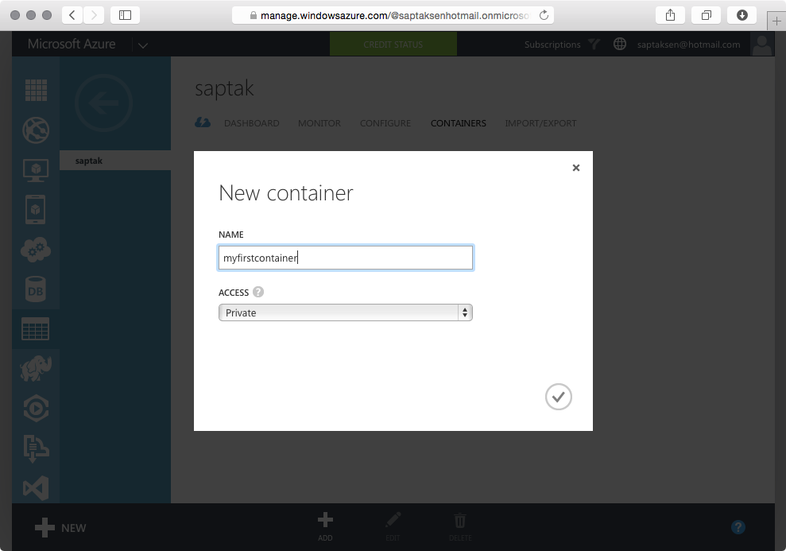
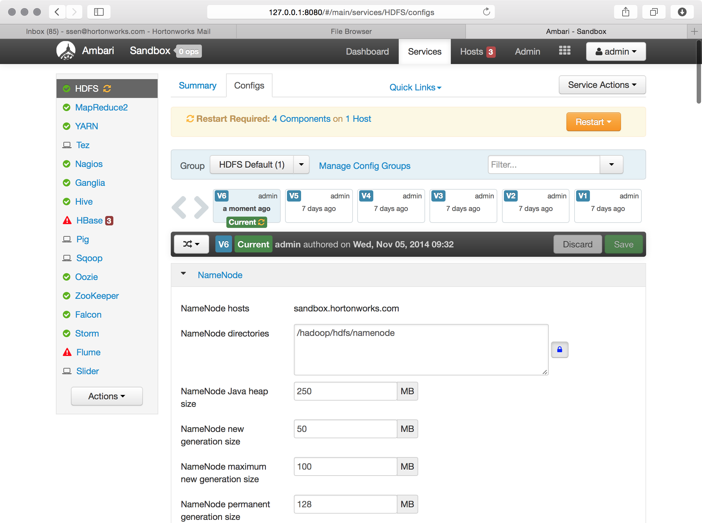
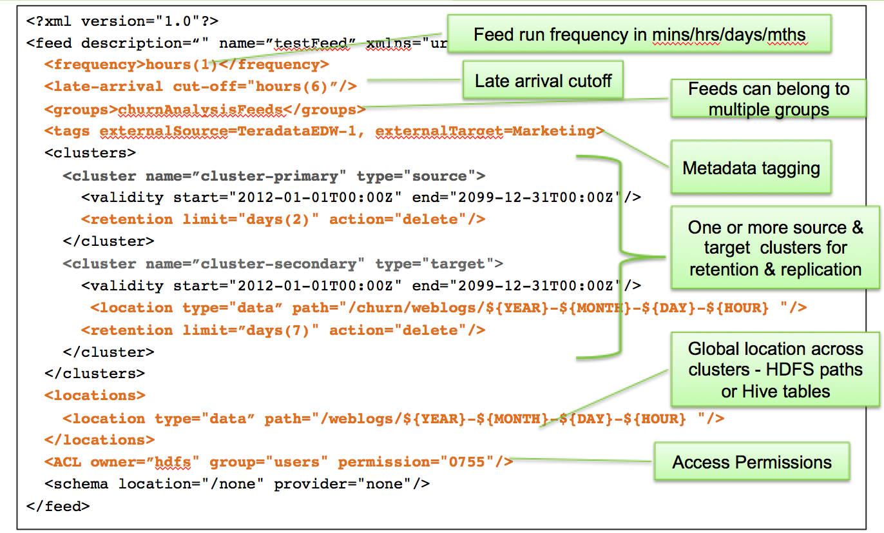

## Introduction

Apache Falcon simplifies the configuration of data motion with: replication; lifecycle management; lineage and traceability. This provides data governance consistency across Hadoop components.

## Scenario

In this tutorial we will walk through a scenario where email data gets processed on multiple HDP 2.2 clusters around the country then gets backed up hourly on a cloud hosted cluster . In our example:

*   This cluster is hosted on Windows Azure.
*   Data arrives from all the West Coast production servers. The input data feeds are often late for up to 4 hrs.

The goal is to clean the raw data to remove sensitive information like credit card numbers and make it available to our marketing data science team for customer churn analysis.

To simulate this scenario, we have a pig script grabbing the freely available Enron emails from the internet and feeding it into the pipeline.

## Prerequisite

*   A cluster with Apache Hadoop 2.2 configured
*   A cluster with Apache Falcon configured

The easiest way to meet the above prerequisites is to download the [HDP Sandbox](http://hortonworks.com/downloads)

## Steps for the Scenario

1.  Create cluster specification XML file
2.  Create feed (aka dataset) specification XML file
    *   Reference cluster specification
3.  Create the process specification XML file
    *   Reference cluster specification – defines where the process runs
    *   Reference feed specification – defines the datasets that the process manipulates

We have already created the necessary xml files. In this step we are going to download the specifications and use them to define the topology and submit the storm job.

### Downloading and staging the dataset

Now let’s stage the dataset using the commandline. Although we perform many of these file operations below using the command line, you can also do the same with the `HDFS Files  View` in Ambari.

First SSH into the Hortonworks Sandbox with the command:

  

The default password is `hadoop`

Then login as user `hdfs`

    su - hdfs

Then download the file falcon.zip with the following command"

    wget http://hortonassets.s3.amazonaws.com/tutorial/falcon/falcon.zip

and then unzip with the command

    unzip falcon.zip

  

Now let’s give ourselves permission to upload files

    hadoop fs -chmod -R 777 /user/ambari-qa

then let’s create a folder `falcon` under `ambari-qa` with the command

    hadoop fs -mkdir /user/ambari-qa/falcon

  

Now let’s upload the decompressed folder with the command

    hadoop fs -copyFromLocal demo /user/ambari-qa/falcon/

  

### Setting up the destination storage on Microsoft Azure

Login to the Windows Azure portal at [http://manage.windowsazure.com](http://manage.windowsazure.com)

Create a storage account

Wait for the storage account to be provisioned

Copy the access key and the account name in a text document. We will use the access key and the account name in later steps

The other information you will want to note down is the blob endpoint of the storage account we just created

Click on the `Containers` tab and create a new container called `myfirstcontainer`.

### Configuring access to Azure Blob store from Hadoop

Login to Ambari – http://127.0.0.1:8080 with the credentials `admin` and `admin`.

Then click on HDFS from the bar on the left and then select the `Configs` tab.

Scroll down to the bottom of the page to the `Custom hdfs-site` section and click on `Add  property...`

In the `Add  Property` dialog, the key name will start with `fs.azure.account.key.` followed by your blob endpoint that you noted down in a previous step. The value will be the Azure storage key that you noted down in a previous step. Once you have filled in the values click the `Add` button:

Once you are back out of the new key dialog you will have to `Save` it by clicking on the green `Save` button:

Then restart all the service by clicking on the orange `Restart` button:

Wait for all the restart to complete

Now let’s test if we can access our container on the Azure Blob Store.

SSH in to the VM:

`ssh root@127.0.0.1  -p 2222;`

The password is `hadoop`

`hdfs dfs -ls -R wasb://myfirstcontainer@saptak.blob.core.windows.net/`

Issue the command from our cluster on the SSH’d terminal

### Creating the cluster entities

Before creating the cluster entities, we need to create the directories on HDFS representing the two clusters that we are going to define, namely `primaryCluster` and `backupCluster`.

Use `hadoop fs -mkdir` commands to create the directories `/apps/falcon/primaryCluster` and `/apps/falcon/backupCluster` directories on HDFS.

    hadoop fs -mkdir /apps/falcon/primaryCluster
    hadoop fs -mkdir /apps/falcon/backupCluster

  

Further create directories called `staging` inside each of the directories we created above:

    hadoop fs -mkdir /apps/falcon/primaryCluster/staging
    hadoop fs -mkdir /apps/falcon/backupCluster/staging

  

Next we will need to create the `working` directories for `primaryCluster` and `backupCluster`

    hadoop fs -mkdir /apps/falcon/primaryCluster/working
    hadoop fs -mkdir /apps/falcon/backupCluster/working

  

Finally you need to set the proper permissions on the staging/working directories:

    hadoop fs -chmod 777 /apps/falcon/primaryCluster/staging
    hadoop fs -chmod 755 /apps/falcon/primaryCluster/working
    hadoop fs -chmod 777 /apps/falcon/backupCluster/staging
    hadoop fs -chmod 755 /apps/falcon/backupCluster/working
    hadoop fs –chown –R falcon /apps/falcon/*

Let’s open the Falcon Web UI. You can easily launch the Falcon Web UI from Ambari:

  

You can also navigate to the Falcon Web UI directly on our browser. The Falcon UI is by default at port 15000\. The default username is `ambari-qa` and the password is `admin`.

  

This UI allows us to create and manage the various entities like Cluster, Feed, Process and Mirror. Each of these entities are represented by a XML file which you either directly upload or generate by filling up the various fields.

You can also search for existing entities and then edit, change state, etc.

  

Let’s first create a couple of cluster entities. To create a cluster entity click on the `Cluster` button on the top.

Then click on the `edit` button over XML Preview area on the right hand side of the screen and replace the XML content with the XML document below:

    <?xml version="1.0" encoding="UTF-8" standalone="yes"?>
    <cluster name="primaryCluster" description="this is primary cluster" colo="primaryColo" xmlns="uri:falcon:cluster:0.1">
        <tags>primaryKey=primaryValue</tags>
        <interfaces>
            <interface type="readonly" endpoint="hftp://sandbox.hortonworks.com:50070" version="2.2.0"/>
            <interface type="write" endpoint="hdfs://sandbox.hortonworks.com:8020" version="2.2.0"/>
            <interface type="execute" endpoint="sandbox.hortonworks.com:8050" version="2.2.0"/>
            <interface type="workflow" endpoint="http://sandbox.hortonworks.com:11000/oozie/" version="4.0.0"/>
            <interface type="messaging" endpoint="tcp://sandbox.hortonworks.com:61616?daemon=true" version="5.1.6"/>
        </interfaces>
        <locations>
            <location name="staging" path="/apps/falcon/primaryCluster/staging"/>
            <location name="temp" path="/tmp"/>
            <location name="working" path="/apps/falcon/primaryCluster/working"/>
        </locations>
        <ACL owner="ambari-qa" group="users" permission="0x755"/>
        <properties>
            <property name="test" value="value1"/>
        </properties>
    </cluster>

Click `Finish` on top of the XML Preview area to save the XML.  

Falcon UI should have automatically parsed out the values from the XML and populated in the right fields. Once you have verified that these are the correct values press `Next`.

  

Click `Save` to persist the entity.

  

Similarly, we will create the `backupCluster` entity. Again click on `Cluster` button on the top to open up the form to create the cluster entity.

Then click on the `edit` button over XML Preview area on the right hand side of the screen and replace the XML content with the XML document below:

    <?xml version="1.0" encoding="UTF-8" standalone="yes"?>
    <cluster name="backupCluster" description="this is backup colo" colo="backupColo" xmlns="uri:falcon:cluster:0.1">
        <tags>backupTag=backupTagValue</tags>
        <interfaces>
            <interface type="readonly" endpoint="hftp://sandbox.hortonworks.com:50070" version="2.2.0"/>
            <interface type="write" endpoint="hdfs://sandbox.hortonworks.com:8020" version="2.2.0"/>
            <interface type="execute" endpoint="sandbox.hortonworks.com:8050" version="2.2.0"/>
            <interface type="workflow" endpoint="http://sandbox.hortonworks.com:11000/oozie/" version="4.0.0"/>
            <interface type="messaging" endpoint="tcp://sandbox.hortonworks.com:61616?daemon=true" version="5.1.6"/>
        </interfaces>
        <locations>
            <location name="staging" path="/apps/falcon/backupCluster/staging"/>
            <location name="temp" path="/tmp"/>
            <location name="working" path="/apps/falcon/backupCluster/working"/>
        </locations>
        <ACL owner="ambari-qa" group="users" permission="0x755"/>
        <properties>
            <property name="key1" value="val1"/>
        </properties>
    </cluster>

Click `Finish` on top of the XML Preview area to save the XML and then the `Next` button to verify the values.

  

Click `Save` to persist the `backupCluster` entity.

  

### Defining the rawEmailFeed entity

To create a feed entity click on the `Feed` button on the top of the main page on the Falcon Web UI.

Then click on the edit button over XML Preview area on the right hand side of the screen and replace the XML content with the XML document below:

    <?xml version="1.0" encoding="UTF-8" standalone="yes"?>
    <feed name="rawEmailFeed" description="Raw customer email feed" xmlns="uri:falcon:feed:0.1">
        <tags>externalSystem=USWestEmailServers</tags>
        <groups>churnAnalysisDataPipeline</groups>
        <frequency>hours(1)</frequency>
        <timezone>UTC</timezone>
        <late-arrival cut-off="hours(1)"/>
        <clusters>
            <cluster name="primaryCluster" type="source">
                <validity start="2015-07-22T01:00Z" end="2015-07-22T10:00Z"/>
                <retention limit="days(90)" action="delete"/>
            </cluster>
        </clusters>
        <locations>
            <location type="data" path="/user/ambari-qa/falcon/demo/primary/input/enron/${YEAR}-${MONTH}-${DAY}-${HOUR}"/>
            <location type="stats" path="/"/>
            <location type="meta" path="/"/>
        </locations>
        <ACL owner="ambari-qa" group="users" permission="0x755"/>
        <schema location="/none" provider="/none"/>
    </feed>

Click `Finish` on the top of the XML Preview area

  

Falcon UI should have automatically parsed out the values from the XML and populated in the right fields. Once you have verified that these are the correct values press `Next`.

  

On the Clusters page ensure you modify the validity to a time slice which is in the very near future.

Click `Next`

  

Save the feed

  

### Defining the rawEmailIngestProcess entity

Now lets define the `rawEmailIngestProcess`.

To create a process entity click on the `Process` button on the top of the main page on the Falcon Web UI.

Then click on the edit button over XML Preview area on the right hand side of the screen and replace the XML content with the XML document below:

    <?xml version="1.0" encoding="UTF-8" standalone="yes"?>
    <process name="rawEmailIngestProcess" xmlns="uri:falcon:process:0.1">
        <tags>email=testemail</tags>
        <clusters>
            <cluster name="primaryCluster">
                <validity start="2015-07-22T01:00Z" end="2015-07-22T10:00Z"/>
            </cluster>
        </clusters>
        <parallel>1</parallel>
        <order>FIFO</order>
        <frequency>hours(1)</frequency>
        <timezone>UTC</timezone>
        <outputs>
            <output name="output" feed="rawEmailFeed" instance="now(0,0)"/>
        </outputs>
        <workflow name="emailIngestWorkflow" version="4.0.1" engine="oozie" path="/user/ambari-qa/falcon/demo/apps/ingest/fs"/>
        <retry policy="exp-backoff" delay="minutes(3)" attempts="3"/>
        <ACL owner="ambari-qa" group="users" permission="0x755"/>
    </process>

Click `Finish` on the top of the XML Preview area

  

Accept the default values and click next

  

On the Clusters page ensure you modify the validity to a time slice which is in the very near future and then click next

  

Accept the default values and click Next

  

Let’s `Save` the process.

  

### Defining the cleansedEmailFeed

Again, to create a feed entity click on the `Feed` button on the top of the main page on the Falcon Web UI.

Then click on the edit button over XML Preview area on the right hand side of the screen and replace the XML content with the XML document below:

    <?xml version="1.0" encoding="UTF-8" standalone="yes"?>
    <feed name="cleansedEmailFeed" description="Cleansed customer emails" xmlns="uri:falcon:feed:0.1">
        <tags>cleanse=cleaned</tags>
        <groups>churnAnalysisDataPipeline</groups>
        <frequency>hours(1)</frequency>
        <timezone>UTC</timezone>
        <late-arrival cut-off="hours(4)"/>
        <clusters>
            <cluster name="primaryCluster" type="source">
                <validity start="2015-07-22T01:00Z" end="2015-07-22T10:00Z"/>
                <retention limit="hours(90)" action="delete"/>
                <locations>
                    <location type="data" path="/user/ambari-qa/falcon/demo/primary/processed/enron/${YEAR}-${MONTH}-${DAY}-${HOUR}"/>
                    <location type="stats" path="/"/>
                    <location type="meta" path="/"/>
                </locations>
            </cluster>
            <cluster name="backupCluster" type="target">
                <validity start="2015-07-22T01:00Z" end="2015-07-22T10:00Z"/>
                <retention limit="hours(90)" action="delete"/>
                <locations>
                    <location type="data" path="/falcon/demo/bcp/processed/enron/${YEAR}-${MONTH}-${DAY}-${HOUR}"/>
                    <location type="stats" path="/"/>
                    <location type="meta" path="/"/>
                </locations>
            </cluster>
        </clusters>
        <locations>
            <location type="data" path="/user/ambari-qa/falcon/demo/processed/enron/${YEAR}-${MONTH}-${DAY}-${HOUR}"/>
            <location type="stats" path="/"/>
            <location type="meta" path="/"/>
        </locations>
        <ACL owner="ambari-qa" group="users" permission="0x755"/>
        <schema location="/none" provider="/none"/>
    </feed>

Click `Finish` on the top of the XML Preview area

  

Accept the default values and click Next

  

Accept the default values and click Next

  

On the Clusters page ensure you modify the validity to a time slice which is in the very near future and then click Next

  

  

Accept the default values and click Save

  

### Defining the cleanseEmailProcess

Now lets define the `cleanseEmailProcess`.

Again, to create a process entity click on the `Process` button on the top of the main page on the Falcon Web UI.

Then click on the edit button over XML Preview area on the right hand side of the screen and replace the XML content with the XML document below:

    <?xml version="1.0" encoding="UTF-8" standalone="yes"?>
    <process name="cleanseEmailProcess" xmlns="uri:falcon:process:0.1">
        <tags>cleanse=yes</tags>
        <clusters>
            <cluster name="primaryCluster">
                <validity start="2015-07-22T01:00Z" end="2015-07-22T10:00Z"/>
            </cluster>
        </clusters>
        <parallel>1</parallel>
        <order>FIFO</order>
        <frequency>hours(1)</frequency>
        <timezone>UTC</timezone>
        <inputs>
            <input name="input" feed="rawEmailFeed" start="now(0,0)" end="now(0,0)"/>
        </inputs>
        <outputs>
            <output name="output" feed="cleansedEmailFeed" instance="now(0,0)"/>
        </outputs>
        <workflow name="emailCleanseWorkflow" version="pig-0.13.0" engine="pig" path="/user/ambari-qa/falcon/demo/apps/pig/id.pig"/>
        <retry policy="exp-backoff" delay="minutes(5)" attempts="3"/>
        <ACL owner="ambari-qa" group="users" permission="0x755"/>
    </process>

Click `Finish` on the top of the XML Preview area

  

Accept the default values and click Next

  

On the Clusters page ensure you modify the validity to a time slice which is in the very near future and then click Next

  

Select the Input and Output Feeds as shown below and Save

### Submit the entities to the cluster:

#### Cluster Specification

Cluster specification is one per cluster.

See below for a sample cluster specification file.

Back to our scenario, lets submit the ‘oregon cluster’ entity to Falcon. This signifies the primary Hadoop cluster located in the Oregon data center.

`falcon entity -type cluster -submit -file oregonCluster.xml`

Then lets submit the ‘virginia cluster’ entity to Falcon. This signifies the backup Hadoop cluster located in the Virginia data center

`falcon entity -type cluster -submit -file virginiaCluster.xml`

If you view the XML file you will see how the cluster location and purpose has been captured in the XML file.

#### Feed Specification

A feed (a.k.a dataset) signifies a location of data and its associated replication policy and late arrival cut-off time.

See below for a sample feed (a.k.a dataset) specification file.

Back to our scenario, let’s submit the source of the raw email feed. This feed signifies the raw emails that are being downloaded into the Hadoop cluster. These emails will be used by the email cleansing process.

`falcon entity -type feed -submit -file rawEmailFeed.xml`

Now let’s define the feed entity which will handle the end of the pipeline to store the cleansed email. This feed signifies the emails produced by the cleanse email process. It also takes care of replicating the cleansed email dataset to the backup cluster (virginia cluster)

`falcon entity -type feed -submit -file cleansedEmailFeed.xml`

#### Process

A process defines configuration for a workflow. A workflow is a directed acyclic graph(DAG) which defines the job for the workflow engine. A process definition defines the configurations required to run the workflow job. For example, process defines the frequency at which the workflow should run, the clusters on which the workflow should run, the inputs and outputs for the workflow, how the workflow failures should be handled, how the late inputs should be handled and so on.

Here is an example of what a process specification looks like:

Back to our scenario, let’s submit the ingest and the cleanse process respectively:

The ingest process is responsible for calling the Oozie workflow that downloads the raw emails from the web into the primary Hadoop cluster under the location specified in the rawEmailFeed.xml It also takes care of handling late data arrivals

`falcon entity -type process -submit -file emailIngestProcess.xml`

The cleanse process is responsible for calling the pig script that cleans the raw emails and produces the clean emails that are then replicated to the backup Hadoop cluster

`falcon entity -type process -submit -file cleanseEmailProcess.xml`

### Schedule the Falcon entities

So, all that is left now is to schedule the feeds and processes to get it going.

#### Ingest the feed

`falcon entity -type feed -schedule -name rawEmailFeed`

`falcon entity -type process -schedule -name rawEmailIngestProcess`

#### Cleanse the emails

`falcon entity -type feed -schedule -name cleansedEmailFeed`

`falcon entity -type process -schedule -name cleanseEmailProcess`

### Processing

In a few seconds you should notice that that Falcon has started ingesting files from the internet and dumping them to new folders in HDFS.

In a couple of minutes you should notice a new folder called processed under which the files processed through the data pipeline are being emitted.

We just created an end-to-end data pipeline to process data. The power of the Apache Falcon framework is its flexibility to work with pretty much any open source or proprietary data processing products out there.
