## Lab 1: Simulating and Transporting Real Time Event Stream with

Apache Kafka

## Introduction

[Apache Kafka](http://kafka.apache.org/&sa=D&ust=1452621795987000&usg=AFQjCNG3tOmWrSlgNP4VdKdBTW1D7y6CGQ) can be used on the Hortonworks Data Platform to capture these data real-time events. In coming tutorials, you will learn how to  persist stream of events  to different data stores/queue (HBase, HDFS, ActiveMQ) for further analysis.

We will begin with showing you the configuring settings of Apache Kafka and Zookeeper. Next a topic named ‘truckevent' will be created. Topic is a is a user-defined category to which messages are published. We will proceed ahead to create Producer and Consumer. Producers will publish random messages to the topic and Consumer will subscribe the messages related to a topic(In our case ‘truckevent’). We have also included code highlights at the end of this tutorial for your reference.

## Prerequisites

A working Hadoop cluster: the easiest way to get a pre-configured and fully functional Hadoop cluster is to download the HDP 2.3 [Hortonworks SandBox](http://hortonworks.com/products/hortonworks-sandbox/&sa=D&ust=1452621795990000&usg=AFQjCNEWWm3hzbthl6QjURE5Sh18qmTldw). Make sure to increase the memory to at least 8GB RAM and preferably 4 processor cores, otherwise you may encounter errors in the third tutorial

## 

## Outline

*   Introduction
*   Prerequisites
*   Apache Kafka basics
*   Step 1: Login to Ambari User Views
*   Step 2: Start Apache Kafka
*   Step 3: Kafka Configs
*   Step 4: Creating Kafka Producer
*   Step 5: Loading the data
*   Step 6: Creating Kafka Consumer
*   Step 7: Code Review

## Apache Kafka:

[Apache Kafka](http://kafka.apache.org/&sa=D&ust=1452621795996000&usg=AFQjCNHjsrCE65J9D2pw5TtDMloTQCJX1w) is an open source messaging system designed for:

*   Persistent messaging
*   High throughput
*   Distributed
*   Multi-client support
*   Real time

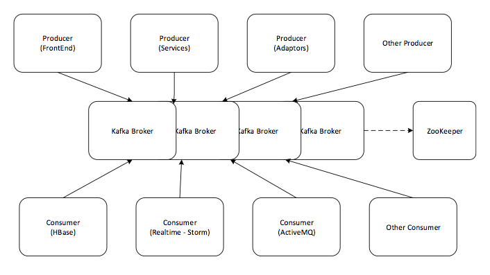

Kafka Producer-Broker-Consumer

In this tutorial, you will learn the following topics:

1.  Install and Start Kafka on HDP 2.3 [Hortonworks Sandbox](http://hortonworks.com/products/hortonworks-sandbox/).
2.  Review Kafka and ZooKeeper Configs
3.  Create Kafka topics for Truck events.
4.  Writing Kafka Producers for Truck events.

## 

## 

## 

### Step 1: Login to Ambari

**1. Start the Hortonworks Sandbox.**

After downloading the Sandbox and running the VM, login to the Sandbox using the URL displayed in the console. For example, the URL in the screenshot below is `http://172.16.251.244:8000/`

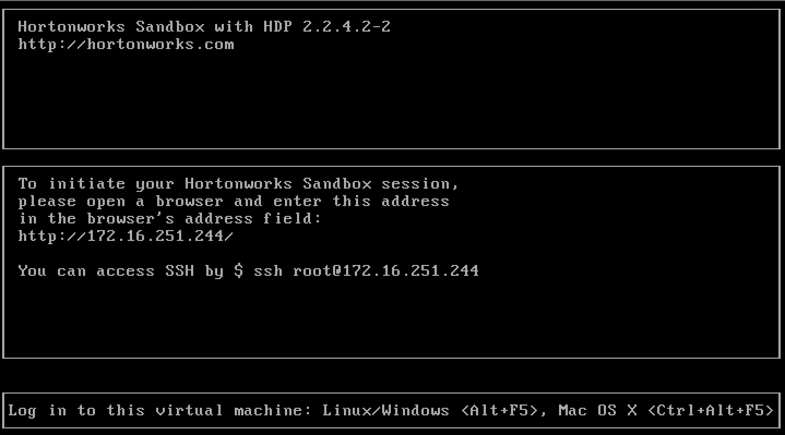

**2. Login to Ambari**

Go to port 8080 of your Sandbox’s IP address to view the Ambari login page. For example, http://172.16.251.244:8080:

The username and password are both admin.

### Step 2: Start Kafka

**1.  View the Kafka Services page**

From the Dashboard page of Ambari, click on Kafka from the list of installed services. (If Kafka is not installed, perform the steps in Appendix A first.):

**2.Start Kafka**

From the Kafka page, click on Service Actions -> Start:

Check the box and click on Confirm Start:

Wait for Kafka to start.

### Step 3: Configure Kafka with ZooKeeper

ZooKeeper serves as the coordination interface between the Kafka broker and consumers:

The important Zookeeper properties can be checked in Ambari.

**1.  Configure ZooKeeper**

Click on ZooKeeper in the list of services, then click on the Configs tab. Verify ZooKeeper is running on port 2181:

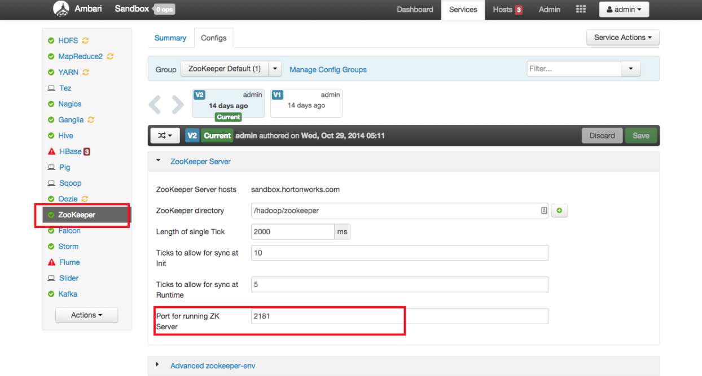

If this port 2181 is busy or is consumed by other processes, then you could change the default port number of ZooKeeper to any other valid port number. If ZooKeeper is not running, you can start the Zookeeper service from Ambari:

**2\. Configure Kafka**

From the Kafka page, click on the Configs tab. Verify the `zookeeper.connect` property points to your ZooKeeper server name and port:

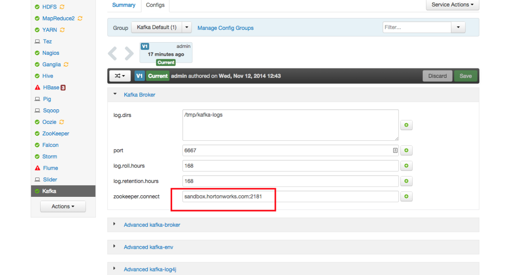

### Step 4: Define a Kafka Topic

**1.  SSH into the Sandbox**

We will SSH in to the Sandbox to the perform the remaining tasks of this tutorial. To SSH in to the Sandbox on Windows, press **Alt+**F5 in the VM window. On a Mac, press **Command+Ctrl+Alt+F5**.

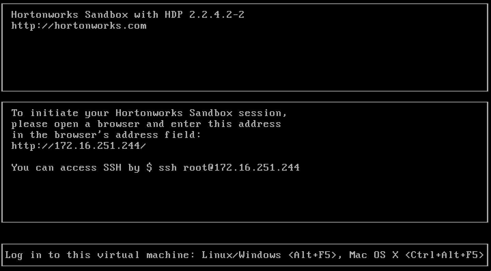

_NOTE: You can also SSH using a program like Putty for Windows or the Terminal application on a Mac. The command to login is ssh root@127.0.0.1 -p 2222_

You will be prompted for a login:

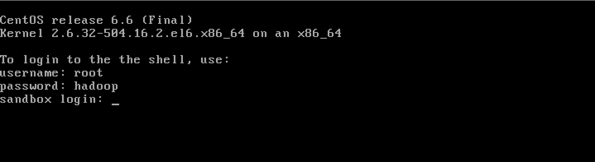

Type in `root` as the login, and the password is `hadoop`.

**TIP**: After typing in the VM, press the Ctrl key on Windows (or Command+Ctrl on Mac) to regain control of the cursor.

**2. Create a new Topic**

Using the `kafka-topics.sh` script (which should be in your PATH), create a new topic named `truckevent`:

    [root@sandbox ~]# kafka-topics.sh --create --zookeeper localhost:2181 --replication-factor 1 --partitions 1 --topic truckevent  

If the `kafka-topics.sh` script is not in your PATH and you get a command not found error, then change directories to where the Kafka scripts are installed:

    [root@sandbox ~]# cd /usr/hdp/current/kafka-broker/bin/

You will need to **add a dot and a slash (./)** to the beginning of the commands:

    [root@sandbox bin]# ./kafka-topics.sh --create --zookeeper localhost:2181 --replication-factor 1 --partitions 1 --topic truckevent 
    
Also note that sometimes ZooKeeper does not listen on `localhost`, so you may need to use the Sandbox’s IP address instead.

The output should look like:

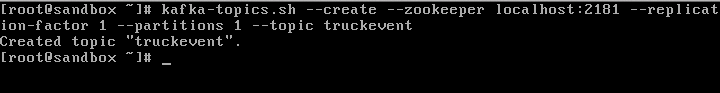

**3. Verify the topic was created successfully**

Check if topic `truckevent` was created successfully with the following command:

    [root@sandbox ~]# ./kafka-topics.sh --list --zookeeper localhost:2181

You should see `truckevent` in the list of topics (and probably your only topic):

### Overview of Producing Messages  

Producers are applications that create Messages and publish them to the Kafka broker for further consumption:

In this tutorial we shall use a Java API to produce Truck events. The Java code in `TruckEventsProducer.java` will generate data with following columns:

    `driver_name` string,    
    `driver_id` string,    
    `route_name` string,    
    `route_id` string,    
    `truck_id` string,    
    `timestamp` string,    
    `longitude` string,    
    `latitude` string,    
    `violation` string,    
    `total_violations` string

  

This Java Truck events producer code uses [New York City Truck Routes (kml)](http://www.nyc.gov/html/dot/downloads/misc/all_truck_routes_nyc.kml) file which defines road paths with Latitude and Longitude information.

### Step 5: Download the Data

1.  Download the New York City Truck Routes

Run the following commands to download the TruckEventsProducer Java code and the NYC Truck routes kml file. This may take a minute or two to download depending on the internet connection

    [root@sandbox ~]# mkdir /opt/TruckEvents   
    [root@sandbox ~]# cd /opt/TruckEvents   
    [root@sandbox TruckEvents]# wget https://www.dropbox.com/s/rv43a05czfaqjlj/Tutorials-master-2.3.zip  
    [root@sandbox TruckEvents]# unzip Tutorials-master-2.3.zip
    [root@sandbox TruckEvents]# cd /opt/TruckEvents/Tutorials-master  

Note: The source code for all the tutorials is located in "src" subdirectory and the pre-compiled binaries for all the tutorials are in the "target" subdirectory. If you would like to modify/run the code, refer to Appendix B for the steps to install and run maven.

### Step 6: Run Kafka Producer

To start the Kafka Producer we execute the following command to see the output as shown in the screenshot below.

    java -cp target/Tutorial-1.0-SNAPSHOT.jar com.hortonworks.tutorials.tutorial1.TruckEventsProducer sandbox.hortonworks.com:6667 sandbox.hortonworks.com:2181

After a few seconds, press Control-C to stop the producer.

We have now successfully compiled and had the Kafka producer publish some messages to the Kafka cluster.

To verify, execute the following command to start a consumer to see the produced events:

    [root@sandbox Tutorials-master]# /usr/hdp/current/kafka-broker/bin/kafka-console-consumer.sh --zookeeper sandbox.hortonworks.com:2181 --topic truckevent --from-beginning

   
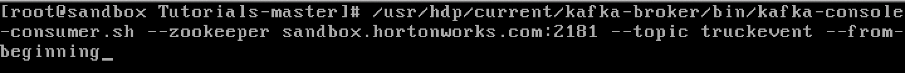  

You can press Control-C to stop the console consumer (i.e keep Control key pressed and then press C)

## Code description:

## Producer:

We use the TruckEventsProducer.java file under the src/main/java/tutorial1/ directory to generate the Kafka TruckEvents. This uses the all_truck_routes_nyc.kml data file available from [NYC DOT](http://www.nyc.gov/html/dot/html/motorist/trucks.shtml). We use Java API’s to produce Truck Events.

    [root@sandbox ~]# ls /opt/TruckEvents/Tutorials-master/src/main/java/com/hortonworks/tutorials/tutorial1/TruckEventsProducer.java

   
    [root@sandbox ~]# ls /opt/TruckEvents/Tutorials-master/src/main/resources/all_truck_routes_nyc.kml  

The java file contains 3 functions

*   `public class TruckEventsProducer`

We configure the Kafka producer in this function to serialize and send the data to Kafka Topic ‘truckevent’ created in the tutorial. The code below shows the Producer class used to generate messages.

    String TOPIC = "truckevent";    
    ProducerConfig config = new ProducerConfig(props);    
    Producer<String, String> producer = new Producer<String, String>(config);  

The properties of the producer are defined in the ‘props’ variable. The events, truckIds and the driverIds data is selected with random function from the array variables.

    Properties props = new Properties();    
    props.put("metadata.broker.list", args[0]);    
    props.put("zk.connect", args[1]);    
    props.put("serializer.class", "kafka.serializer.StringEncoder");    
    props.put("request.required.acks", "1");  

    String[] events = {"Normal", "Normal", "Normal", "Normal", "Normal", "Normal", "Lane Departure","Overspeed", "Normal", "Normal", "Normal", "Normal", "Lane Departure","Normal","Normal", "Normal", "Normal",  "Unsafe tail distance", "Normal", "Normal","Unsafe following distance", "Normal", "Normal", "Normal","Normal","Normal","Normal","Normal","Normal","Normal","Normal","Normal","Normal","Normal", "Normal", "Overspeed","Normal", "Normal","Normal","Normal","Normal","Normal","Normal" };

    String[] truckIds = {"1", "2", "3","4"};

    String[] routeName = {"route17", "route17k", "route208", "route27"};

    String[] driverIds = {"11", "12", "13", "14"};

`KeyedMessage` class takes the topic name, partition key, and the message value that needs to be passed from the producer as follows:

#### class KeyedMessage(K, V)

    KeyedMessage<String, String> data = new KeyedMessage<String, String>(TOPIC, finalEvent);  

The Kafka producer events with timestamps are created by selecting the data from above arrays and geo location from the all_truck_routes_nyc.kml file.

    KeyedMessage<String, String> data = new KeyedMessage<String, String>(TOPIC, finalEvent);    
    LOG.info("Sending Messge #:" + i +", msg:" + finalEvent);    
    producer.send(data);    
    Thread.sleep(1000);'  

To transmit the data we now build an array using the GetKmlLangList() and getLatLong() function.

*   private static String getLatLong

This function returns coordinates in Latitude and Longitude format.

    if (latLong.length == -1)    
    {  
       return latLong[1].trim() + "|" + latLong[0].trim();    
    }  

*   public static String[] GetKmlLanLangList

This method is reading KML file which is an XML file. This xml file is loaded in File fXmlFile variable.

    File fXmlFile = new File(urlString);  

Which will parse this file by running through each node (Node.ELEMENT_NODE) in loop. The XML element "coordinates" has array of two items lat, long. The function reads the lat, long and returns the values in array.

## Conclusion

This tutorial gave you brief glimpse of how to use Apache Kafka to transport real-time events data. In our next tutorial, you will see how to capture data from Kafka Producer into Storm for processing

## Appendix A: Installing Kafka

Follow these steps if your version of the Sandbox does not have Kafka installed:

1.  From the Ambari Dashboard, select Actions -> Add Service:

2\.  Select Kafka from the list of Services and click Next:

3\.  Keep clicking Next with the selected defaults until you reach the following screen:

4\.  Set the value of logs.dir to  /tmp/kafka-logs
5\.  Click the Deploy button:

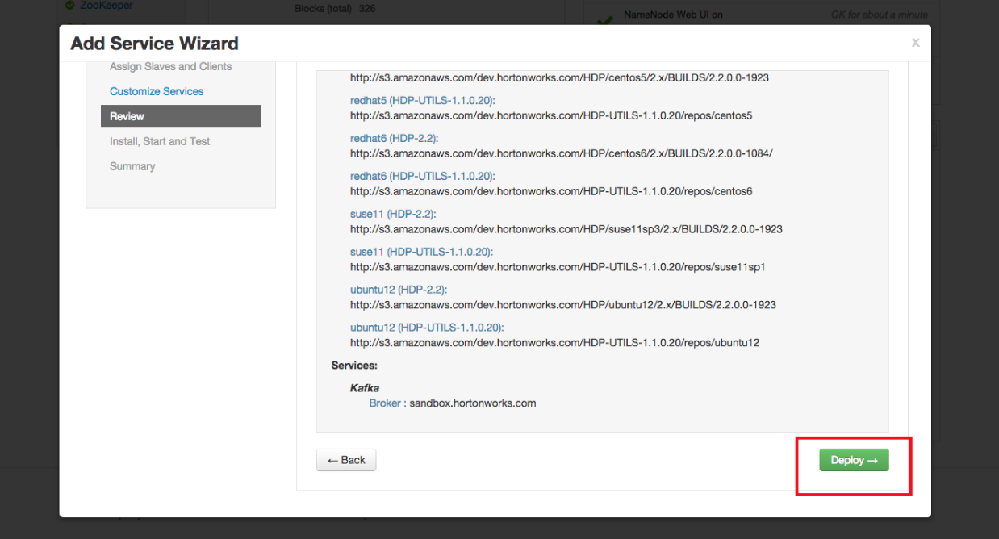

6\.  Wait for Kafka to install:

7\.  After Kafka is installed, you may be asked to restart some dependent Services. Please select the appropriate Services and click Restart.

## Appendix B: Install Maven and compile

Download and install Apache Maven as shown in the commands below

    curl -o /etc/yum.repos.d/epel-apache-maven.repo https://repos.fedorapeople.org/repos/dchen/apache-maven/epel-apache-maven.repo
      yum -y install apache-maven
      mvn -version  

Maven Version

Now lets compile and execute the code to generate Truck Events. (This may run for a 5-6 minutes, depending on your internet connection)

    cd /opt/TruckEvents/Tutorials-master    
    mvn clean package  

    mvn clean pacakge

Once the code is successfully compiled we shall see a new target directory created in the current folder. The binaries for all the Tutorials are in this target directory and the source code in src.

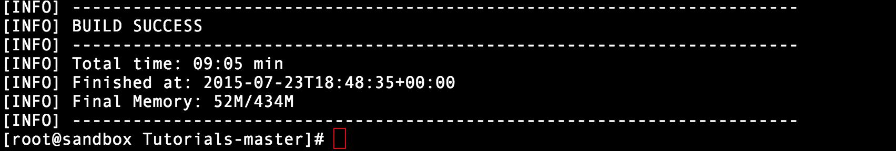

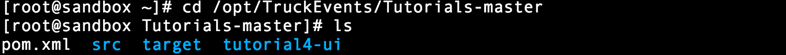