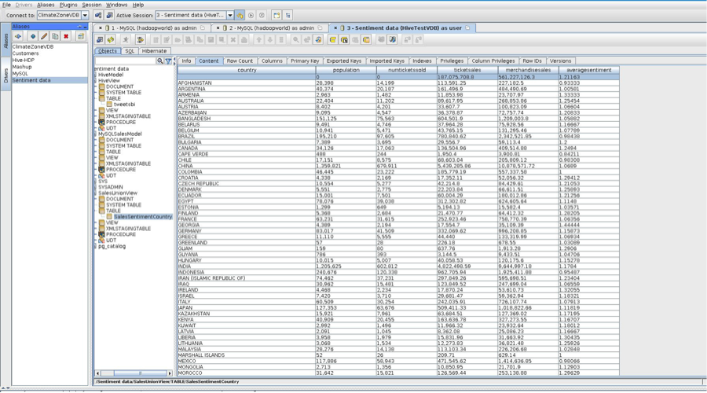

## Overview

This use case is the sentiment analysis and sales analysis with Hadoop and MySQL. It uses one Hortonworks Data Platform VM for the twitter sentiment data and one MySQL database for the sales data.

*   **Objective:** Determine if sentiment data from the first week of the Iron Man 3 movie is a predictor of sales
*   **Problem:** Cannot utilize social data and sentiment analysis with sales management system
*   **Solution:** Leverage Jboss Data Virtualization to mashup Sentiment analysis data with ticket and merchandise sales data on MySQL into a single view of the data

## Prerequisites

*   A working HDP cluster
    *   The easiest way to have a HDP cluster is to download the Hortonworks [Sandbox](http://hortonworks.com/products/hortonworks-sandbox/)
*   Tutorial Supporting Files and Source hosted on [GitHub](https://github.com/DataVirtualizationByExample/HortonworksUseCase1/tree/master/SupportingFiles)
*   Watch the recorded [video](http://youtu.be/UZWb_eLMcYc)

## Getting started

**Watch the tutorial**

**Install Hortonworks Data Platform with Sentiment Data**

There are two options to install the HDP with sentiment data. The first is to import the Virtual Box VM with the tweetsbi data already loaded. The second is to use one of the options for the HDP and then load the twitter data in from tweetsbi.csv or the tutorial. For these instructions we are going to concentrate on downloading the HDP Sandbox and importing the tweetsbi data so that you have the most current Sandbox. The sandbox will contain the tweets with sentiment data.

**Step 1:** Download and install HDP according to the instructions: [http://hortonworks.com/products/hortonworks-sandbox/#install](http://hortonworks.com/products/hortonworks-sandbox/#install)

**Step 2:** Load the sentiment data into the HDP. You can either follow the tutorial below to go through the complete process to create tweetsbi or just load the tweetsbi table from the tweetsbi.csv.

*   Tutorial: [http://hortonworks.com/hadoop-tutorial/how-to-refine-and-visualize-sentiment-data/](http://hortonworks.com/hadoop-tutorial/how-to-refine-and-visualize-sentiment-data/)
*   To load the data from tweetsbi.csv download the [csv](https://github.com/DataVirtualizationByExample/HortonworksUseCase1/blob/master/SupportingFiles/tweetsbi.csv) which is also contained [here.](https://github.com/DataVirtualizationByExample/HortonworksUseCase1/tree/master/SupportingFiles)

Next create the tweetsbi table from a file by browsing to _http://hdp-vm:8000/hcatalog/create/create_from_file …_then enter tweetsbi as the tablename, choosing the tweetsbi.csv and then clicking create table. Make sure the delimeter is changed to a comma but keep the other defaults.

**Step 3:** In Ambari using admin/admin verify some configuration by Ambari > Services > Configs >

Advanced. This should be done to avoid having to issue grants when doing imports.

*   hive.security.authorization.enabled, change from true to false
*   hive.server2.enable.doAs, change from true to false. Optionally, and recommended for performance, change this option.
*   hive.execution.engine, change from mr to tez

Restart All Hive Services

**NOTE:** Should you skip step 3 or have permission errors when access the tweetsbi table through hive  then issue the query below through h_ttp://hdp-vm:8000/beeswax/_  
grant select on table tweetsbi to user hdfs;

**Install MySQL with Sales Data**

MySQL will contain the sales data for the iron man movie. MySQL can be installed locally but we will use MySQL on the HDP Sandbox.

**Step 1:** Grant privileges for the local machine for DV and SquirreL client to connect to the MySQL instance on the sandbox. Log into sandbox as root, type in “mysql” and then enter the following

command where  is the local host IP .

mysql> use mysql

mysql> GRANT ALL ON *.* to admin@’172.16.155.1′ IDENTIFIED BY ‘admin’;

mysql> FLUSH PRIVILEGES;

**Step 2:** Download the sql script which is also contained in the [Supporting files](https://github.com/DataVirtualizationByExample/HortonworksUseCase1/tree/master/SupportingFiles) and then scp  root@

**Step 3:** Run the sql script to create the database, table and data

mysql < sales-create-table-and-data.sql

**Step 4:** Test user and check table by signing on _mysql -u admin -p’admin’ hadoopworld_

**Step 5:** Check database

_SELECT * FROM sales;_

**Install SQuirreL Client to test the database connections**

NOTE: SquirreL Client is running on the local/host to connect to DV and the HDP VM.  Also the jar files in squirrelclient.zip in the SupportingFiles should be extracted to the SquirreL client lib folder.

**Step 1:** Download and install SquirreL client to test the databases

[http://squirrel-sql.sourceforge.net/](http://squirrel-sql.sourceforge.net/)

**Step 2:** Install the jdbc drivers by downloading them from the below which are also contained in the

[Support files on Github](https://github.com/DataVirtualizationByExample/HortonworksUseCase1/tree/master/SupportingFiles) and placing them in the SquirreL client lib folder

Hive (hive0jdbc-0.11.0.jar): [Supporting files on Github](https://github.com/DataVirtualizationByExample/HortonworksUseCase1/tree/master/SupportingFiles)

MySQL (mysql-connector-java-5.1.25-bin.jar): [Supporting files on Github](https://github.com/DataVirtualizationByExample/HortonworksUseCase1/tree/master/SupportingFiles)

Teiid (teiid-8.4.1-redhat-2-jdbc.jar):  [Supporting files on Github](https://github.com/DataVirtualizationByExample/HortonworksUseCase1/tree/master/SupportingFiles)

Setup the Drivers for according to the below which should give a blue checkmark beside the driver

Hive: Class Name: org.apache.hive.jdbc.HiveDriver

Example URL: jdbc:hive2://localhost:10000/default

Mysql: Class Name: com.mysql.jdbc.Driver

Example URL: jdbc:mysql://hostname:3306/dbname

Unififed View (Teiid): Class Name: org.teiid.jdbc.TeiidDriver

Example URL: jdbc:teiid:theVDB@mm://localhost:31000

**Step 3:** Setup the database connections according to the below

Hive:

Name: Hive-HDP

Driver: Apache Hive

URL: jdbc:hive2://:10000/default

Username: hdfs

Password: empty

Mysql:

Name: MySQL

Driver: MySQL

URL: jdbc:mysql://:3306/hadoopworld

User: admin

Password: admin

Unififed View (Teiid):

Name: SalesSentimentCountry

Driver: Teiid JDBC Driver

URL: jdbc:teiid:HiveTestVDB@mm://localhost:31000

User: user

Password: user

**Step 4:** Connect to the databases and select the tables then the content tab to see the database

A. HDP-VM preview tweetsbi which will take some time for the data to be returned the first time.

Subsequent queries will be a lot faster.

B. MYSQL on HDP-VM preview sales which should be quick

C. Sentiment preview which will preview the unified view (NOTE: will not work until after DV has

been installed and running)

**Install Data Virtualization with Virtual Database**

**Step 1:** Clone the Simplified Data Virtualization template.

[https://github.com/kpeeples/simplified-dv-template.git](https://github.com/kpeeples/simplified-dv-template.git)

**Step 2:** Download Data Virtualization to the distros folder from

[http://www.jboss.org/products/datavirt/download/](http://www.jboss.org/products/datavirt/download/)

**Step 3:** Run the install-run.sh script to install the DV server

**Step 4:** Stop the server

**Step 5:** Create the Hive Module by creating the org/apache/hadoop/hive directory under the

DV_ROOT/modules/system/layers/base folder and then unzipping the org-apache-hive.zip files to the

new folder

**Step 6:** Deploy the MySQL JDBC driver from the support folder by going to localhost:8080 and

clilcking on the admin console with the username admin and password redhat1!. Then click on manage

deployments and click add

**Step 7:** Setup a new datasource called MySQLSalesModel with the MySQL driver according to  
MySQLSalesModel” pool-name=”MySQLSalesModel” enabled=”true”>

connection-url>jdbc:mysql://:3306/hadoopworldconnection-url>

driver>mysql-connector-java-5.1.25-bin.jardriver>

security>

user-name>adminuser-name>

password>adminpassword>

security>

datasource>

**Step 8:** Setup a new datasource called HiveConnection with the Hive driver according to

 jndi-name=”java:/HiveConnection” pool-name=”HiveConnection” enabled=”true”>

connection-url>jdbc:hive2://:10000/defaultconnection-url>

driver>hivedriver>

security>

user-name>hdfsuser-name>

password>adminpassword>

security>

datasource>

**Step 9:** Step 9: Deploy the HiveTestVDB from the Supporting files on github by following the same process as step 6

**Step 10:** Start the server by running standalone.sh -b 0.0.0.0 from the DV_ROOT/bin

**Test the unified view**

Data Virtualization Dashboard

**Step 1:** Test the Data Virtualization Dashboard. While the DV server is running browse to: localhost:8080/dashboard

**Step 2:** Create the Teiid external connections

****

**Step 3:** Create the data provider

****

**Step 4:** Create the workspace

**Step 5:** Create a new page after selecting the newly created workspace

**Step 6:** Create a new panel after selecting the newly created page

**Step 7:** Select the key performance indicator and drag and drop to the panel

**Step 8:** Select the created data provider

**Step 9:** Select the Data Table to see the data in a spreadsheet

**SquirreL Client**

**Step 1:** Preview the content for the SalesSentimentCountry Table with the datasource that was setup above

**Pull the data into Libreoffice spreadsheet**

Note: You can use Microsoft Excel as well as Powerview in Excel in addition to Libreoffice.

**Step 1:** Install the ODBC Driver According to the platform

[https://access.redhat.com/documentation/en-US/Red_Hat_JBoss_Data_Virtualization/6/html/Development_Guide_Client_Development/chap-ODBC_Support.html](https://access.redhat.com/documentation/en-US/Red_Hat_JBoss_Data_Virtualization/6/html/Development_Guide_Client_Development/chap-ODBC_Support.html)

**Step 2:** Create a new database connection in Libreoffice Calc

Similar to [http://www.easysoft.com/applications/openoffice_org/odbc.html](http://www.easysoft.com/applications/openoffice_org/odbc.html)

We hope you have fun with this tutorial! Happy Hadoop-ing!