## Data Visualization using Apache Zeppelin

## Introduction:

Apache Zeppelin provides a powerful web-based notebook platform for data analysis and discovery.  Behind the scenes it supports Spark distributed contexts as well as other language bindings on top of Spark.

In this tutorial we will be using Apache Zeppelin to run SQL queries on our geolocation, trucks, and riskfactor data that we’ve collected earlier and visualize the result through graphs and charts.

NOTE: We can also run queries via various [interpreters](https://www.google.com/url?q=https://zeppelin.incubator.apache.org/docs/manual/interpreters.html&sa=D&ust=1454521925901000&usg=AFQjCNGsBVuMGxSbVFUaAkgN5bEzhbP-yw) for the following (but not limited to) spark, hawq and postgresql.

## Prerequisites:

*   Working Zeppelin installation. 
*   Make sure Hive services are up and running. (Check in Ambari dashboard)
*   Make sure Spark services are up and running.(Check in Ambari dashboard)
*   Lab 3 or 4.

Step 1: Creating a Zeppelin Notebook

*   Click on Ambari User view icon and navigate to Zeppelin notebook.

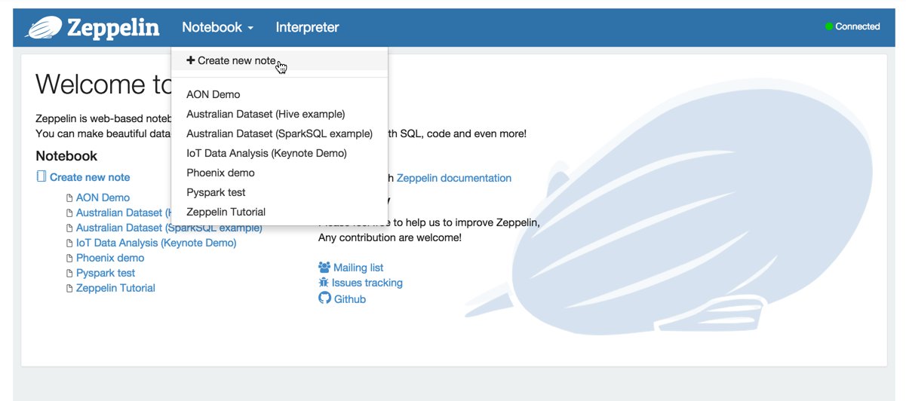

*   NOTE: You can also navigate to [http://sandbox.hortonworks.com:9995](https://www.google.com/url?q=http://sandbox.hortonworks.com:9995/&sa=D&ust=1454521925906000&usg=AFQjCNFA6Fxa_hnuHVTsDTgIRyie51y1yg) directly to open the Zeppelin interface.

*   You can also change the port that the zeppelin server runs on by Navigating to the Ambari service > configs > Advanced zeppelin config and then changing the zeppelin.server.port.
*   You may also need to modify the forwarded ports on the virtual machine as well if you do this.

*   Click on create notebook and a new workbook shall get started. Name the note Driver Risk Factor

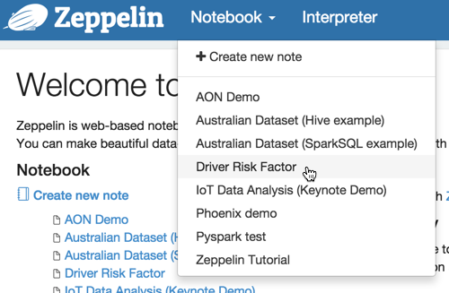

*   After creating the new note, use the dropdown menu from the Notebook button to

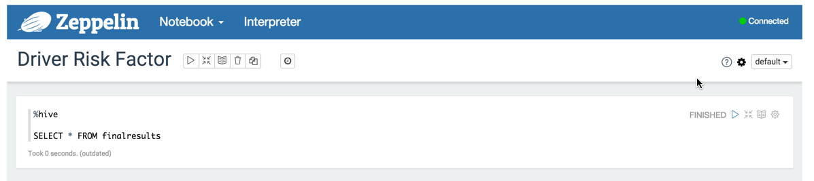

Step 2: Running a Hive query

*   In the previous Spark and Pig tutorials you already created a table finalresults which gives the risk factor associated with every driver. We will use the data we generated in this table to visualize which drivers have the highest risk factor.
*   Copy and paste the code below into your Zeppelin note.

~~~~
%hive

SELECT * FROM finalresults
~~~

 

*   Click    to run the query in the Zeppelin notebook.

*   Initially, the query will produce the data in tabular format as shown in the screenshot.

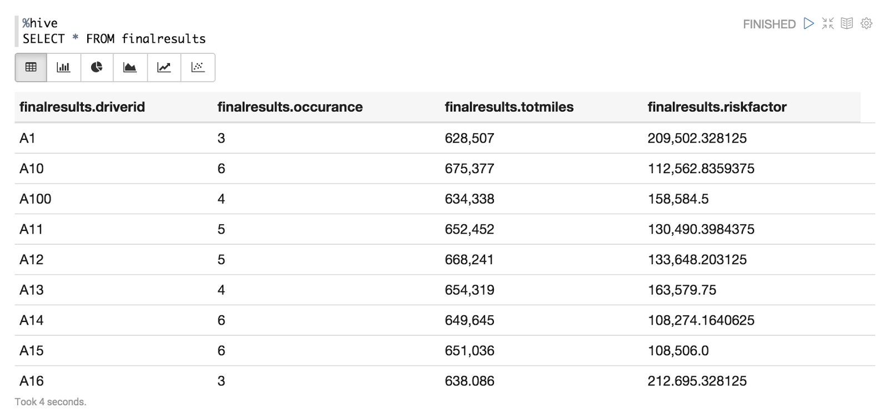

Step 3: Making charts using Zeppelin

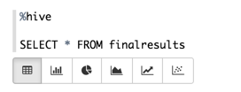

*   Iterate through each of the tabs that appear underneath the query. Each one will display a different type of chart depending on the data that is returned in the query. 2
*   After clicking on a chart, we can view extra advanced settings to tailor the view of the data we want

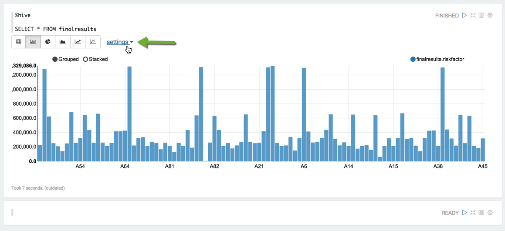

*   Click settings to open the advanced chart features.
*   To make the same chart as the one above, drag the table relations into the boxes as shown in the image below.

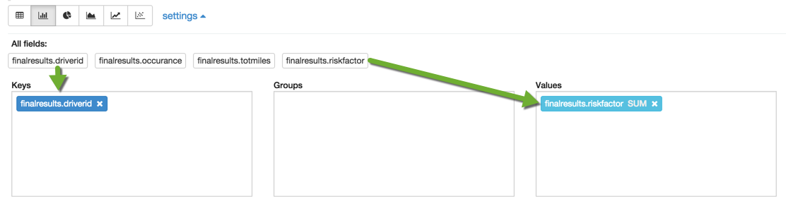

*   You should now see an image like the one below.

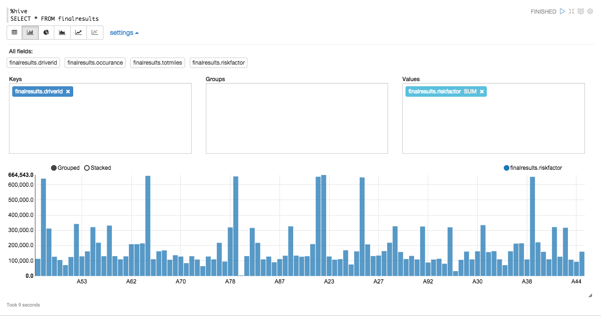

*   If you hover on the peaks, each will give the driverid and riskfactor.

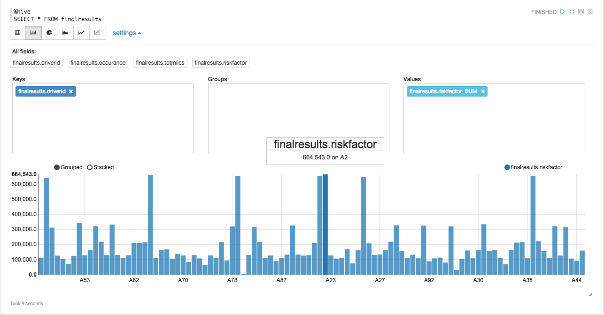

*    Try experimenting with the different types of charts as well as dragging and dropping the different table fields to see what kind of results you can obtain.

*   Let’ try a different query to find which cities and states contain the drivers with the highest riskfactors.

~~~
%hive

SELECT a.driverid, a.riskfactor, b.city, b.state FROM finalresults a, geolocation b where a.driverid=b.driverid
~~~

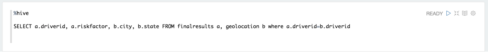

Run the query above using the keyboard shortcut Shift+Enter. You should eventually end up with the results in a table below.

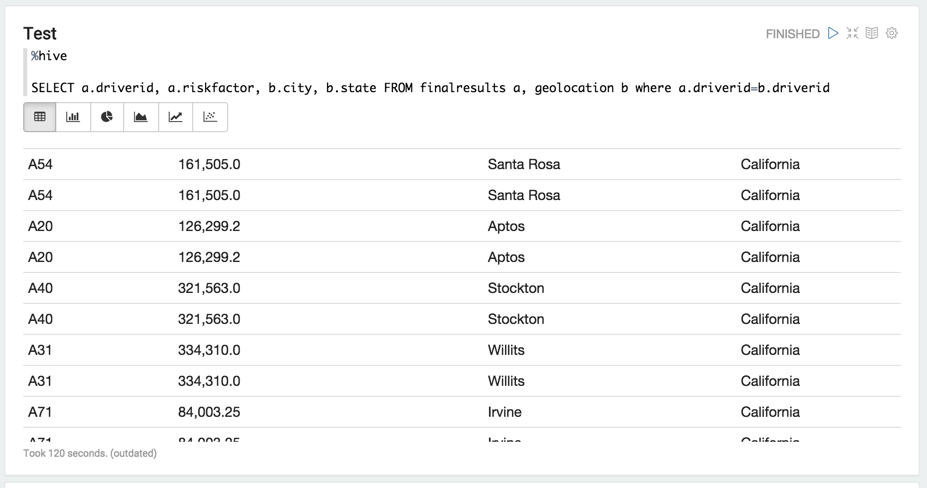

After changing a few of the settings we can figure out which of the cities has the high risk factors. Try changing the chart settings by clicking the scatterplot icon. Then make sure that they keys a.driverid is within the xAxis field, a.riskfactor is in the yAxis field, and b.city is in the group field. The chart should look similar to the following.

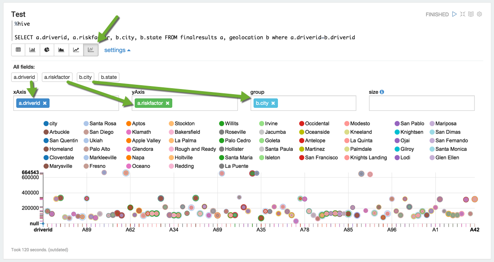

The graph shows that driver id number A39 has a high risk factor of 652417 and drives in Santa Maria.  

## Outro

Now that we know how to use Apache Zeppelin to obtain and visualize our data, we can use the skills we’ve learned from our Hive, Pig, and Spark labs, as well and apply them to new kinds of data to try to make better sense and meaning from the numbers!  

## Suggested Reading

 