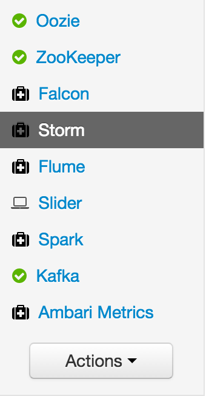
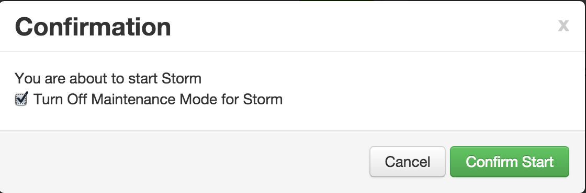
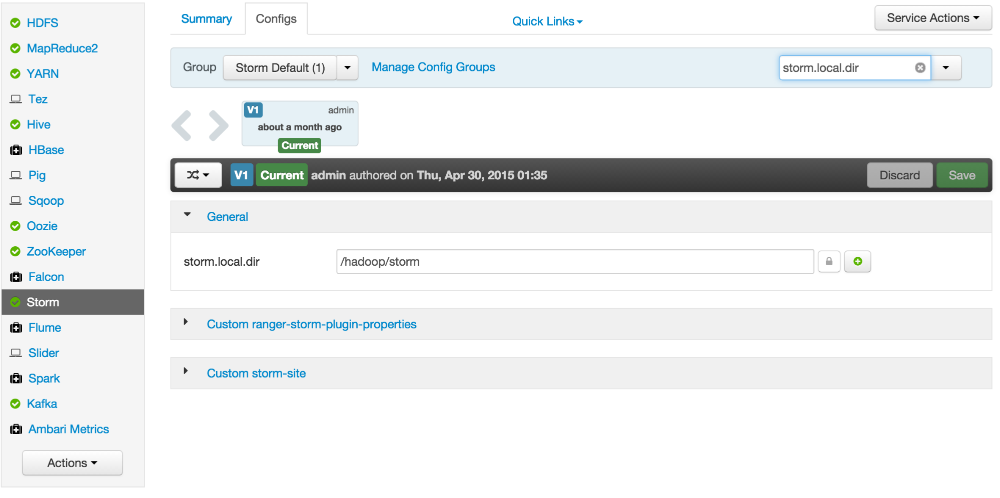
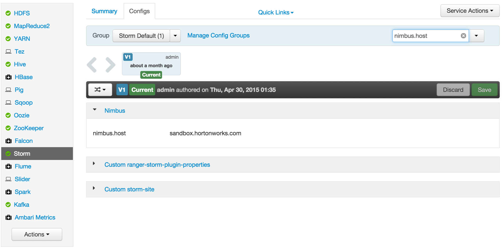
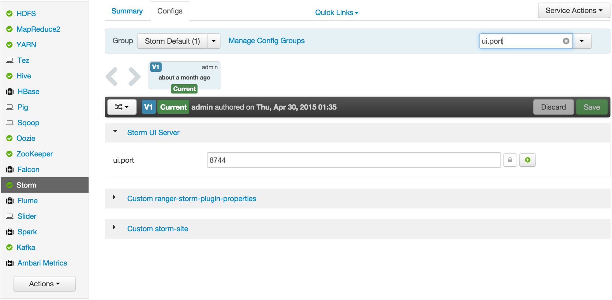
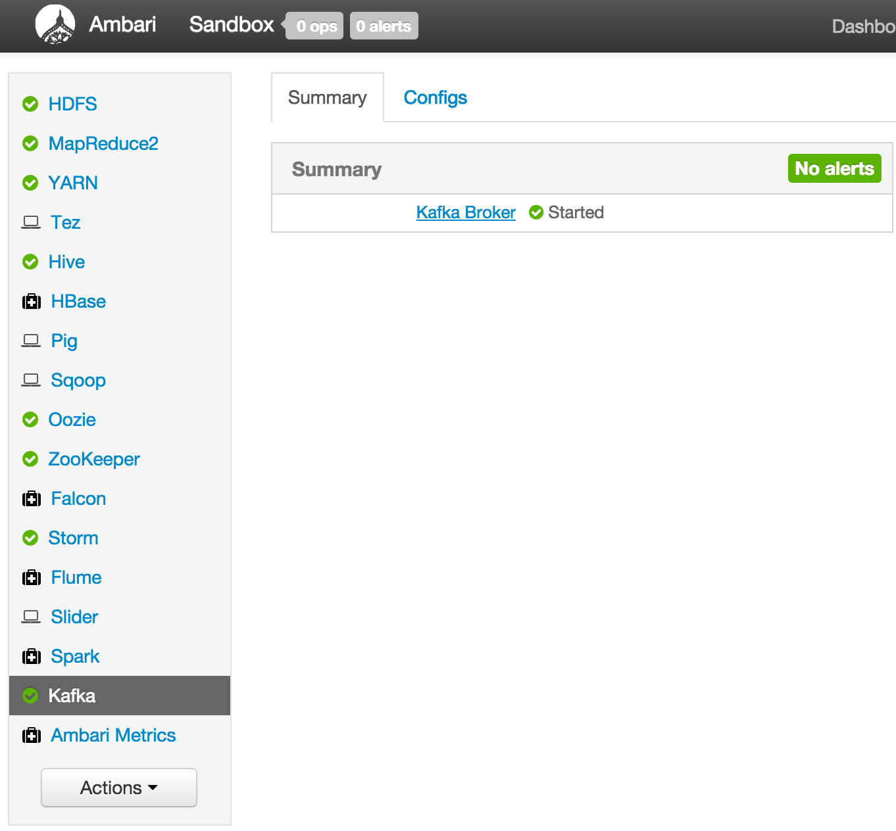
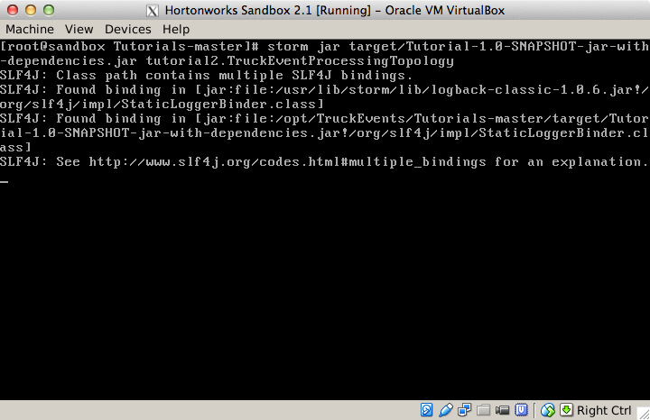
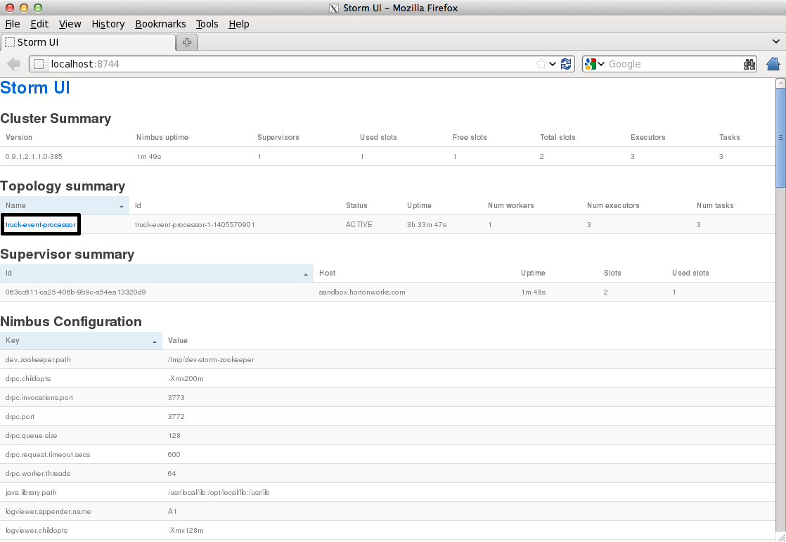
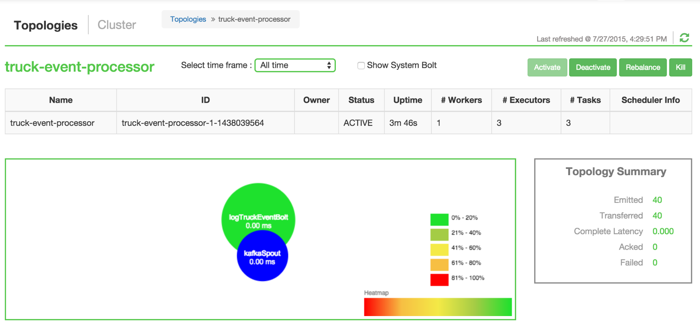
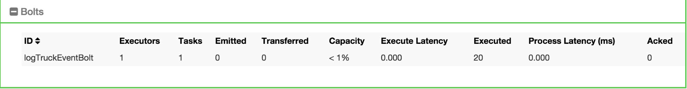

#  Lab 2: Ingesting and processing Real-time events with Apache Storm

##  Introduction

The Trucking business is a high-risk business in which truck drivers venture into remote areas, often in  harsh weather conditions and chaotic traffic on a daily basis. Using this solution illustrating Modern Data Architecture with Hortonworks Data Platform, we have developed a centralized management system that can help reduce risk and lower the total cost of operations.

This system can take into consideration adverse weather conditions, the driver's driving patterns, current traffic conditions and other criteria to alert and inform the management staff and the drivers themselves when risk factors run high.

In the [previous tutorial](http://hortonworks.com/hadoop-tutorial/simulating-transporting-realtime-events-stream-apache-kafka/) you  learned to collect this data using Apache Kafka.

In this tutorial you  will use [**Apache Storm**](http://hortonworks.com/labs/storm/) on the Hortonworks Data Platform to capture these data events and process them in real time for further analysis.

In this tutorial, you will learn the following topics:

*   Managing Storm on HDP.
*   Creating a Storm spout to consume the Kafka `truckevents` generated in [Lab #1](http://hortonworks.com/hadoop-tutorial/simulating-transporting-realtime-events-stream-apache-kafka/).

## 

## Prerequisites

*   ### [Tutorial #1 should be completed successfully.](http://hortonworks.com/hadoop-tutorial/simulating-transporting-realtime-events-stream-apache-kafka/)

### 

## Outline

*   Introduction
*   Prerequisites
*   Apache Storm basics
*   Step 1: Apache Storm Configurations
*   Step 2: Creating Storm Topology
*   Step 3: Code Review

### 

## Apache Storm

Apache Storm is an Open Source distributed, reliable, fault tolerant system for real time processing of data at high velocity.

It's used for:

*   Real time analytics
*   Online machine learning
*   Continuous statics computations
*   Operational Analytics
*   And, to enforce Extract, Transform, and Load (ETL) paradigms.

Spout and Bolt are the two main components in Storm, which work together to process streams of data.

*   Spout: Works on the source of data streams. In the "Truck Events" use case, Spout will read data from Kafka "truckevent" topics.
*   Bolt: Spout passes streams of data to Bolt which processes and persists passes it to either a data store or sends it downstream to another Bolt.

For details on Storm, [click here](http://hortonworks.com/labs/storm/).

### 

### Step 1: Start and Configure Storm.

1.  View the Storm Services page

Started by logging into Ambari as admin/admin. From the Dashboard page of Ambari, click on Storm from the list of installed services. (If you do not see Storm listed under Services, please follow click on Action -> Add Service and select Storm and deploy it.)

2\. Start Storm

From the Storm page, click on Service Actions -> Start

Check the box and click on Confirm Start:

Wait for Storm to start.

3\. Configure Storm

You can check the below configurations by pasting them into the Filter text box under the Service Actions dropdown

#### 

*   Check zookeeper configuration: ensure `storm.zookeeper.servers` is set to `sandbox.hortonworks.com`

*   Check the local directory configuration: ensure `storm.local.dir` is set to `/hadoop/storm`

*   Check the nimbus host configuration: ensure `nimbus.host` is set to `sandbox.hortonworks.com`

*   Check the slots allocated: ensure `supervisor.slots.ports` is set to `[6700, 6701]`

*   Check the UI configuration port: Ensure `ui.port` is set to `8744`

*  Check the Storm UI from the Quick Links

Now you can see the UI:

Storm UI

4\. **Storm User View:** You can alternatively use Storm USer View as well to view the topologies created by you.

*   Go to the Ambari User VIew icon and select Storm :

*    The Storm user view gives you the summary of topologies created by you. As of now we do not have any topologies created hence none are listed in the summary.

### 

### Step 2\. Creating a Storm Spout to consume the Kafka truck events generated in Tutorial #1.

1. Load data if required:

From Lab #1 you already have the required [New York City truck routes](http://www.nyc.gov/html/dot/downloads/misc/all_truck_routes_nyc.kml) KML. If required, you can download the latest copy of the file with the following command.

    [root@sandbox ~]# wget http://www.nyc.gov/html/dot/downloads/misc/all_truck_routes_nyc.kml --directory-prefix=/opt/TruckEvents/Tutorials-master/src/main/resources/  

Recall that the source code is under `/opt/TruckEvents/Tutorials-master/src` directory and pre-compiled jars are under the `/opt/TruckEvents/Tutorials-master/target` directory

**(Optional)** If you would like to modify/run the code:

*   refer to Appendix A at the end of the tutorial for the steps to run maven to compile the jars to the target subdir from terminal command line
*   refer to Appendix B at the end of the tutorial  for the steps to enable VNC (i.e. 'remote desktop') access on your sandbox and open/compile the code using Eclipse

#### 

2\. Verify that Kafka process is running

Verify that Kafka is running using Ambari dashboard. If not, following the steps in tutorial #1

3\.  Creating Storm Topology

We now have 'supervisor' daemon and Kafka processes running.

To do real-time computation on Storm, you create what are called "topologies". A topology is a graph of computation. Each node in a topology contains processing logic, and links between nodes indicate how data should be passed around between nodes.

Running a topology is straightforward. First, you package all your code and dependencies into a single jar. Then, you run a command like the following: The command below will start a new Storm Topology for TruckEvents.

    [root@sandbox ~]# cd /opt/TruckEvents/Tutorials-master/

    [root@sandbox ~]# storm jar target/Tutorial-1.0-SNAPSHOT.jar com.hortonworks.tutorials.tutorial2.TruckEventProcessingTopology  

storm new topology

It should complete with "Finished submitting topology" as shown below.

This runs the class `TruckEventProcessingTopology` .The main function of the class defines the topology and submits it to Nimbus. The storm jar part takes care of connecting to Nimbus and uploading the jar.

Refresh the Storm UI browser window to see new Topology 'truck-event-processor' in the browser.

*   Storm User View will now show a topology formed and running.

4\. Generating TruckEvents

The TruckEvents producer can now be executed as we did in Tutorial #1 from the same dir:

    root@sandbox Tutorials-master]java -cp target/Tutorial-1.0-SNAPSHOT.jar com.hortonworks.tutorials.tutorial1.TruckEventsProducer sandbox.hortonworks.com:6667 sandbox.hortonworks.com:2181  

Truck Events Producer

Go back to the Storm UI and click on **truck-event-processor** topology to drill into it.  Under Spouts you should see that numbers of emitted and transferred tuples is increasing which shows that the messages are processed in real time by Spout

kafkaSpout count

You can press Control-C to stop the Kafka producer (i.e keep Control key pressed and then press C)

**Under Storm User view**: You should be able to see the topology created by you under storm user views.

*   You can also keep track of several statistics of Spouts and Bolts.

## Step 3: Code description

Let us review the code used in this tutorial. The source files are under the `/opt/TruckEvents/Tutorials-master/src/main/java/com/hortonworks/tutorials/tutorial2/` folder.

    [root@sandbox Tutorials-master]# ls -l src/main/java/com/hortonworks/tutorials/tutorial2/    
    total 16    
    -rw-r--r-- 1 root root  861 Jul 24 23:34 BaseTruckEventTopology.java    
    -rw-r--r-- 1 root root 1205 Jul 24 23:34 LogTruckEventsBolt.java    
    -rw-r--r-- 1 root root 2777 Jul 24 23:34 TruckEventProcessingTopology.java    
    -rw-r--r-- 1 root root 2233 Jul 24 23:34 TruckScheme.java    

#### BaseTruckEventTopology.java

    topologyConfig.load(ClassLoader.getSystemResourceAsStream(configFileLocation));  

Is the base class, where the topology configurations is initialized from the `/resource/truck_event_topology.properties` files.

#### TruckEventProcessingTopology.java

This is the storm topology configuration class, where the Kafka spout and LogTruckevent Bolts are initialized. In the following method the Kafka spout is configured.

    private SpoutConfig constructKafkaSpoutConf()    
       {  
    …    
    SpoutConfig spoutConfig = new SpoutConfig(hosts, topic, zkRoot, consumerGroupId);    
    …  
           spoutConfig.scheme = new SchemeAsMultiScheme(new TruckScheme());  

    return spoutConfig;    
       }  

A logging bolt that prints the message from the Kafka spout was created for debugging purpose just for this tutorial.

    public void configureLogTruckEventBolt(TopologyBuilder builder)

    {

    LogTruckEventsBolt logBolt = new LogTruckEventsBolt();

    builder.setBolt(LOG_TRUCK_BOLT_ID, logBolt).globalGrouping(KAFKA_SPOUT_ID);

    }

The topology is built and submitted in the following method;

    private void buildAndSubmit() throws Exception

    {

    ...

    StormSubmitter.submitTopology("truck-event-processor",

    conf, builder.createTopology());

    }

#### TruckScheme.java

Is the deserializer provided to the kafka spout to deserialize kafka byte message stream to Values objects.

    public List<Object> deserialize(byte[] bytes)    
           {  
           try    
                   {  
               String truckEvent = new String(bytes, "UTF-8");    
               String[] pieces = truckEvent.split("\\|");  

               Timestamp eventTime = Timestamp.valueOf(pieces[0]);    
               String truckId = pieces[1];    
               String driverId = pieces[2];    
               String eventType = pieces[3];    
               String longitude= pieces[4];    
               String latitude  = pieces[5];    
               return new Values(cleanup(driverId), cleanup(truckId),    
                                       eventTime, cleanup(eventType), cleanup(longitude), cleanup(latitude));  

           }    
                   catch (UnsupportedEncodingException e)    
                   {  
                       LOG.error(e);    
                       throw new RuntimeException(e);    
           }  

       }  

#### LogTruckEventsBolt.java

LogTruckEvent spout logs the kafka message received from the kafka spout to the log files under `/var/log/storm/worker-*.log`

    public void execute(Tuple tuple)

    {

    LOG.info(tuple.getStringByField(TruckScheme.FIELD_DRIVER_ID) + "," +

    tuple.getStringByField(TruckScheme.FIELD_TRUCK_ID) + "," +

    tuple.getValueByField(TruckScheme.FIELD_EVENT_TIME) + "," +

    tuple.getStringByField(TruckScheme.FIELD_EVENT_TYPE) + "," +

    tuple.getStringByField(TruckScheme.FIELD_LATITUDE) + "," +

    tuple.getStringByField(TruckScheme.FIELD_LONGITUDE));

    }

## Conclusion

In this tutorial we have learned to capture data from Kafka Producer into Storm Spout. This data can now be processed in real time. In our next Tutorial, using Storm Bolt, you will see how to store data into multiple sources for persistence.

### Appendix A: Compile Storm topology from command line

Compile the code using Maven after downloading a new data file or on completing any changes to the code under /opt/TruckEvents/Tutorials-master/src directory.

    [root@sandbox ~]# cd /opt/TruckEvents/Tutorials-master/    
    [root@sandbox ~]# mvn clean package  

We now have a successfully compiled the code.

### Appendix B: Enabling remote desktop on sandbox and setting up Storm topology as Eclipse project

1.  Setup Ambari VNC service on the sandbox to enable remote desktop via VNC and install eclipse using steps here [https://github.com/hortonworks-gallery/ambari-vnc-service#setup-vnc-service](https://github.com/hortonworks-gallery/ambari-vnc-service%23setup-vnc-service)
2\.  Import code as Eclipse project using steps here:

[https://github.com/hortonworks-gallery/ambari-vnc-service#getting-started-with-storm-and-maven-in-eclipse-environment](https://github.com/hortonworks-gallery/ambari-vnc-service%23getting-started-with-storm-and-maven-in-eclipse-environment)

